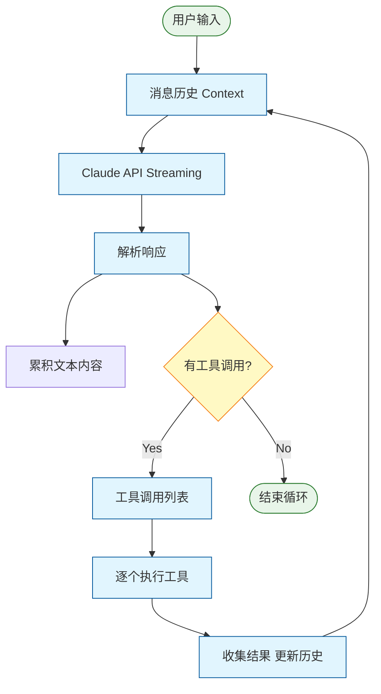

# agentGui

一个现代化的 macOS 原生 AI Agent 客户端，基于 Anthropic Claude API 构建。

## 特性

- **原生 macOS 体验** - 使用 SwiftUI 构建，完美适配 macOS 设计语言
- **Claude API 集成** - 支持所有 Claude 模型（Opus 4.6、Sonnet 4.6、Haiku 4.5 等）
- **多会话管理** - 创建和管理多个对话会话，历史记录本地持久化
- **Agentic Loop** - 完整的多轮工具调用循环，支持复杂任务分解与执行
- **子代理协作** - 内置 8 种专业子代理，支持任务委派和协作
- **工具生态** - 文件编辑、Bash 执行、Web 搜索、图片分析、PDF 读取等
- **技能系统** - 扩展 AI 能力的自定义技能，兼容 Claude Code 技能格式
- **长期记忆** - 在项目记忆目录中持久化跨会话的知识
- **创作记忆** - 面向小说写作的项目级结构化记忆，维护角色、世界规则、时间线和连续性
- **Extended Thinking** - 支持 Claude 3.7+ 的深度推理模式
- **流式响应** - 实时显示 AI 回复，支持 Markdown 渲染
- **Timeline 视图** - 可视化展示 Agent 执行过程和工具调用链
- **块编辑器** - 类似 Notion 的文档编辑器，支持 16+ 种块类型、斜杠命令、行内样式工具栏

## 系统要求

- macOS 15.0+
- Xcode 16.3+
- Swift 6.0+

## 构建

```bash
# 克隆仓库
git clone https://github.com/feint/agentGui.git
cd agentGui

# 在 Xcode 中打开
open agentGui.xcodeproj

# 或使用命令行构建
xcodebuild -project agentGui.xcodeproj -scheme agentGui build
```

## 配置

首次运行时，在「设置」标签页中：

1. 配置 Anthropic API Key（从 [console.anthropic.com](https://console.anthropic.com) 获取）
2. （可选）设置自定义 Base URL 用于兼容代理服务
3. 选择要使用的 Claude 模型
4. 根据需要启用工具和技能
5. 如需小说写作支持，在「创作记忆」中启用项目级记忆并绑定当前会话

## 架构

### Agentic Loop

agentGui 的核心是 **Agentic Loop** —— 一个多轮执行循环，让 Claude 能够自主调用工具、观察结果并持续迭代，直到任务完成。



**核心特性：**
- **流式处理**：实时解析 SSE 事件流，增量更新 UI
- **思考支持**：Claude 3.7+ 的 Extended Thinking 内容单独显示
- **上下文压缩**：当使用率超过 75% 时自动压缩历史消息
- **Token 监控**：实时追踪输入/输出 token 数量和成本

### 子代理系统

主 Agent 可以将任务委派给专业子代理，每个子代理有独立的系统提示、工具集和最大轮次限制。

| 子代理 | 描述 | 工具 | 用途 |
|--------|------|------|------|
| `planner` | 规划师 | 只读 | 分析任务需求，输出结构化执行计划 |
| `explorer` | 探索者 | 只读 + Web | 信息探索、代码库分析、资料汇总 |
| `coder` | 编写者 | 读写 + Bash | 实现代码变更，可运行命令验证 |
| `reviewer` | 审查者 | 只读 | 代码质量、安全性、规范性审查 |
| `executor` | 执行者 | Bash | 运行构建、测试、脚本等命令 |
| `summarizer` | 总结员 | 只读 | 读取文件/文档，生成简洁总结 |
| `writer` | 写作者 | 读写 + Bash | 专业写作辅助：生成、润色、翻译 |
| `outline_planner` | 大纲规划师 | 只读 | 文档结构规划、章节组织 |

**委派流程：**
1. 主 Agent 调用 `run_subagent` 工具
2. 系统创建独立的嵌套 Loop，传入子代理专用配置
3. 子代理运行（无递归，限制轮次）
4. 返回结果文本给主 Agent

### 工具系统

agentGui 通过工具扩展 Claude 的能力：

| 工具 | 功能 |
|------|------|
| `str_replace_based_edit_tool` | 文件查看、创建、编辑、插入 |
| `bash` | 持久化 Shell 会话，支持工作目录 |
| `web_search` | Web 搜索（Bing / inference.sh） |
| `web_fetch` | 网页内容抓取与清理 |
| `analyze_image` | 本地图片文件分析（Vision API） |
| `read_pdf` | PDF 文本提取 |
| `ask_user_question` | 结构化用户交互（暂停 Loop） |
| `update_todo_list` | 任务列表管理 |
| `memory_write` | 长期记忆写入 |
| `read_skill` | 技能内容加载 |
| `run_subagent` | 子代理委派 |

### 创作记忆

创作记忆是独立于 `memory.md` 的项目级结构化记忆层，适合长篇小说、世界观设定和连续性敏感的写作任务。

- **作用范围**：围绕 `WritingProject` 保存角色卡、世界规则、章节、场景、时间线、伏笔和连续性问题
- **启用方式**：在设置页打开「启用创作记忆」，然后创建创作项目并把当前会话绑定到该项目
- **Prompt 注入**：运行时会根据当前请求自动拼装活跃角色、相关规则、最近事件和未解决伏笔，而不是把整个项目全文塞进上下文
- **与长期记忆的区别**：`memory_write` 面向全局偏好和跨任务经验；创作记忆只保存故事 canon，不写入 `~/.agentgui/memory.md`

当前内置的创作记忆工具包括：

- `story_memory_create_project`
- `story_memory_attach_project`
- `story_memory_upsert_character`
- `story_memory_append_event`
- `story_memory_query`
- `story_memory_verify_continuity`

## 项目结构

```
agentGui/
├── Models/                         # SwiftData 数据模型
│   ├── Session.swift                  # 对话会话
│   ├── Message.swift                  # 聊天消息
│   ├── ToolCall.swift                 # 工具调用记录
│   ├── AgentRound.swift               # Agent 执行轮次
│   ├── AgentMessage.swift             # 子代理消息
│   ├── AgentLoopPhase.swift           # 循环阶段枚举
│   ├── AppSettings.swift              # 应用设置
│   ├── SubagentDefinition.swift       # 子代理定义
│   ├── TodoItem.swift                 # 待办事项
│   ├── ExecutionPlan.swift            # 执行计划
│   ├── AttachedFile.swift             # 文件附件
│   ├── Skill.swift                    # 技能定义
│   └── Enums.swift                    # 枚举定义
│
├── Views/                          # SwiftUI 视图
│   ├── MainSplitView.swift             # 主界面（三栏布局）
│   ├── ChatView.swift                  # 聊天界面
│   ├── ChatView+*.swift                # 聊天界面扩展
│   ├── SessionListView.swift           # 会话列表
│   ├── SettingsView.swift              # 设置界面（隐式）
│   ├── TimelineView.swift              # 执行时间线（隐式）
│   ├── Editor/                         # 块编辑器
│   │   ├── BlockEditorModels.swift     # 块编辑器模型
│   │   ├── BlockMarkdownCodec.swift    # Markdown 编解码
│   │   ├── BlockDocumentEditor.swift   # 文档编辑器
│   │   ├── BlockTextEditor.swift       # 文本块编辑器
│   │   ├── BlockTableEditor.swift      # 表格块编辑器
│   │   ├── BlockRowView.swift          # 块行视图
│   │   ├── SlashCommandMenu.swift      # 斜杠命令菜单
│   │   ├── InlineStyleToolbarView.swift # 行内样式工具栏
│   │   └── BlockEditor*.swift          # 其他编辑器组件
│   ├── MessageBubbleView.swift         # 消息气泡
│   ├── ThinkingBubbleView.swift        # 思考气泡
│   ├── ToolCallBubbleView.swift        # 工具调用气泡
│   ├── AskUserQuestionView.swift       # 用户问题视图
│   ├── SubagentTimelineView.swift      # 子代理时间线
│   ├── TodoListView.swift              # 待办列表视图
│   ├── ArtifactDrawerView.swift        # Artifact 抽屉
│   └── [其他组件视图...]
│
├── Services/                       # 业务逻辑
│   ├── ClaudeService+AgenticLoop.swift # Agentic Loop 实现
│   ├── ClaudeService+Subagent.swift    # 子代理系统
│   ├── ClaudeService+ToolDispatch.swift # 工具分发
│   ├── ClaudeService+TextEditorTool.swift # 文件编辑工具
│   ├── ClaudeService+WebTools.swift    # Web 工具
│   ├── ClaudeService+MediaTools.swift  # 媒体工具
│   ├── ClaudeService+ContextCompression.swift # 上下文压缩
│   ├── ClaudeService+DynamicContent.swift # 动态内容
│   ├── ClaudeService+ToolBuilder.swift # 工具构建器
│   ├── BashSession.swift               # Shell 会话管理
│   ├── SkillService.swift              # 技能加载器
│   └── ACPClientService.swift          # ACP 客户端服务
│
├── Repositories/                   # 数据访问层
│   └── ...
│
└── Utilities/                      # 工具类和错误类型
    ├── WorkspaceState.swift            # 工作区状态
    ├── ConfigDirectoryManager.swift    # 配置目录管理
    └── ...
```

## 技术栈

- **Swift 6.0+** - 采用最新 Swift 语言特性（并发、发送性检查）
- **SwiftUI** - 声明式 UI 框架
- **SwiftData** - Apple 原生持久化框架
- **SwiftAnthropic** - Anthropic Claude API SDK
- **STTextView / STTextKitPlus** - 高性能文本编辑组件
- **BeautifulMermaid** - Mermaid 图表渲染

## 核心功能

### 块编辑器 (Block Editor)

类似 Notion 的现代化文档编辑器，支持：

- **16+ 种块类型**：段落、标题、引用、列表、待办、代码、表格、图片、链接、文件附件、提示块、折叠块等
- **斜杠命令**：输入 `/` 快速插入任意块类型，支持模糊搜索
- **行内样式**：选中文字后显示工具栏，支持加粗、斜体、删除线、行内代码
- **Markdown 双向转换**：自动解析和生成标准 Markdown 格式
- **高性能**：基于 NSTextView 的原生实现，支持大文件编辑

## 依赖管理

项目使用 Swift Package Manager 管理依赖：

| 依赖 | 版本 | 用途 |
|------|------|------|
| SwiftAnthropic | 2.2.1 | Anthropic Claude API SDK |
| STTextView | 2.3.5 | 高性能文本编辑组件 |
| BeautifulMermaid | 0.1.1 | Mermaid 图表渲染 |

## 内存目录

agentGui 在 `~/.claude/` 下存储用户数据：

```
~/.claude/
├── projects/
│   └── [项目名称]/
│       └── memory/    # 项目记忆文件
└── skills/            # 自定义技能目录
```

说明：上述目录用于长期记忆与技能。创作记忆的小说项目数据保存在应用的 SwiftData 存储中，不复用项目 `memory/` 目录。

## License

MIT License

## 作者

@feint

## 致谢

- [Anthropic](https://www.anthropic.com) - Claude API
- [SwiftAnthropic](https://github.com/jamesrochabrun/SwiftAnthropic) - Swift SDK
- [STTextView](https://github.com/krzyzanowskim/STTextView) - 高性能文本编辑组件
- [BeautifulMermaid](https://github.com/lukilabs/beautiful-mermaid-swift) - Mermaid 图表渲染
- [Claude Code](https://claude.ai/code) - 技能系统设计灵感

## 开发状态

当前分支: `001-ai-agent-client`

项目正在积极开发中，核心功能已基本完成，正在完善块编辑器和子代理系统。
