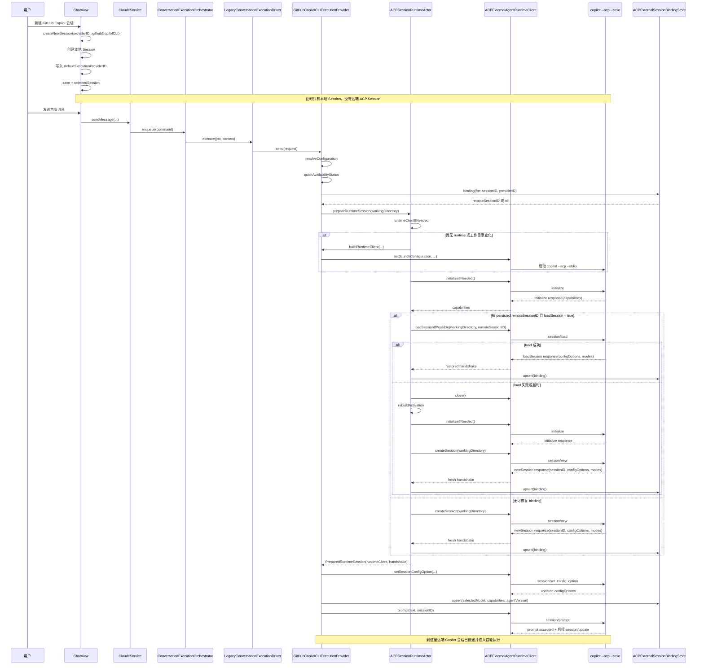

# 2026-03-25 GitHub Copilot CLI 会话创建流程设计

日期：2026-03-25

## 1. 文档目标

本文档回答的问题是：在当前 agentGui 实现里，用户“新建一个 GitHub Copilot CLI 会话”时，真正发生了哪些步骤，以及本地会话与远端 ACP 会话分别在什么时机建立。

本文档覆盖：

1. 新建会话入口如何创建本地 Session。
2. 首次发送消息时，执行链如何从 UI 进入 orchestrator、driver 与 provider。
3. GitHub Copilot CLI provider 如何启动 `copilot --acp --stdio`。
4. ACP runtime 如何执行 `initialize -> session/load 或 session/new -> prompt`。
5. local session、remote session、binding、runtime actor 之间的关系。

非目标：

1. 本文档不讨论完整 `session/update` 增量投影细节。
2. 本文档不展开权限请求、工具调用和消息投影的全部内部状态。
3. 本文档不覆盖 OpenCode、Claude adapter 的差异化流程。

## 2. 结论先行

当前实现里，“新建 GitHub Copilot CLI 会话”不是一个单步骤动作，而是两个阶段：

1. UI 阶段：创建本地 `Session`，并把 `defaultExecutionProviderID` 设为 `github_copilot_cli`。
2. 运行时阶段：在该会话第一次发送消息时，才真正启动 Copilot CLI 的 ACP runtime，并建立或恢复远端 session。

这意味着：

1. 点击“新建会话”后，SwiftData 中已经有一个本地会话对象。
2. 但此时并没有远端 ACP session，也还没有 `ACPExternalSessionBinding`。
3. 只有在首次发送消息后，provider 才会尝试读取旧 binding，判断是否走 `session/load`。
4. 若没有可恢复的远端 session，或恢复失败，则回退到 `session/new`。
5. 一旦握手成功，本地才会写入 `(localSessionID, providerID, remoteSessionID)` 绑定关系。

一句话概括：

> agentGui 先创建“本地聊天容器”，再在第一次实际执行时为这个容器挂接 Copilot CLI 的远端 ACP 会话。

## 3. 相关代码对象

核心入口和对象如下：

1. `agentGui/Views/ChatView+Toolbar.swift`
2. `agentGui/Views/ChatView+Actions.swift`
3. `agentGui/Services/ClaudeService/ClaudeService+Messaging.swift`
4. `agentGui/Services/Execution/ConversationExecutionOrchestrator.swift`
5. `agentGui/Services/Execution/LegacyConversationExecutionDriver.swift`
6. `agentGui/Services/GitHubCopilot/GitHubCopilotCLIExecutionProvider.swift`
7. `agentGui/Services/ACP/ACPExternalExecutionProviderBase.swift`
8. `agentGui/Services/ACP/ACPSessionRuntimeActor.swift`
9. `agentGui/Services/ACP/ACPExternalAgentRuntimeClient.swift`
10. `agentGui/Services/GitHubCopilot/GitHubCopilotCLIRuntimeFactory.swift`
11. `agentGui/Services/ACP/ACPExternalSessionBindingStore.swift`
12. `agentGui/Models/ACPExternalAgentDescriptor.swift`

## 4. 分层理解

为避免把流程混成一团，建议把这条链路分成五层：

1. UI 层：创建本地 session、触发发送。
2. 编排层：把一次发送转换成 execution job，并调度到正确 provider。
3. Provider 层：解析会话配置、保证远端 session 已准备好。
4. Runtime actor 层：处理 runtime 复用、binding 恢复、失败回退。
5. ACP transport 层：通过 stdio 与 `copilot --acp --stdio` 交换 `initialize`、`session/load`、`session/new`、`prompt`。

这种分层很重要，因为：

1. UI 并不直接知道 remote session 是否存在。
2. Provider 不直接控制用户操作，而是响应执行请求。
3. Runtime actor 才是“恢复旧会话还是新建会话”的核心判定点。
4. ACP runtime client 才真正发出协议请求。

## 5. 详细流程图

下面这张图按真实调用顺序展开了本地创建、首次发送、远端恢复和新建分支。

```mermaid
flowchart TD
    A[用户选择 GitHub Copilot 作为新会话执行器] --> B[ChatView.createNewSession]
    B --> C[创建本地 Session]
    C --> D[session.defaultExecutionProviderID = github_copilot_cli]
    D --> E[modelContext.insert + save]
    E --> F[workspaceState.selectedSession = newSession]
    F --> G[本地会话已创建\n远端 ACP 会话尚不存在]

    G --> H[用户输入首条消息并发送]
    H --> I[ChatView.sendMessage]
    I --> J[ClaudeService.sendMessage]
    J --> K[resolveProviderID = githubCopilotCLI]
    K --> L[ConversationExecutionOrchestrator.enqueue]
    L --> M[Execution job 入队]
    M --> N[LegacyConversationExecutionDriver.execute]
    N --> O[GitHubCopilotCLIExecutionProvider.send]

    O --> P[resolveConfiguration\n合并 AppSettings 与 SessionExecutionPreferences]
    P --> Q[quickAvailabilityStatus 检查 copilot CLI]
    Q --> R{CLI 可用?}
    R -- 否 --> R1[抛出 unavailable error]
    R -- 是 --> S[ensureRemoteSessionPrepared]

    S --> T[读取 ACPExternalSessionBinding]
    T --> U[得到 existingRemoteSessionID 或 nil]
    U --> V[resolvedWorkingDirectory]
    V --> W[创建或复用 ACPSessionRuntimeActor]
    W --> X[prepareRuntimeSession]

    X --> Y[runtimeClientIfNeeded]
    Y --> Z[若无 runtime 则 buildRuntimeClient]
    Z --> ZA[GitHubCopilotCLIRuntimeFactory.makeLaunchConfiguration]
    ZA --> ZB[command = copilot]
    ZB --> ZC[arguments = --acp --stdio]
    ZC --> ZD[ACPExternalAgentRuntimeClient.launch]

    ZD --> ZE[initializeIfNeeded]
    ZE --> ZF[发送 ACP initialize]
    ZF --> ZG[缓存 capabilities\nloadSession / model override / agentVersion]

    ZG --> ZH{binding 中有 remoteSessionID\n且 capabilities.loadSession = true?}
    ZH -- 否 --> ZN[直接进入 createSession]
    ZH -- 是 --> ZI[client.loadSessionIfPossible]
    ZI --> ZJ[发送 ACP session/load]
    ZJ --> ZK{load 成功?}
    ZK -- 是 --> ZL[生成 restored handshake]
    ZL --> ZM[bindingPersister 写回 binding]
    ZK -- 否 --> ZO[replaceRuntime\n关闭旧 runtime 并重建 activation]
    ZO --> ZN

    ZN --> ZP[再次确保 runtime 可用]
    ZP --> ZQ[发送 ACP session/new]
    ZQ --> ZR[拿到 remoteSessionID / configOptions / modes]
    ZR --> ZS[生成 fresh handshake]
    ZS --> ZT[bindingPersister 写回 binding]

    ZM --> ZU[返回 PreparedRuntimeSession]
    ZT --> ZU
    ZU --> ZV[Provider 拿到 handshake + runtimeClient]

    ZV --> ZW[initialSessionConfigSelections]
    ZW --> ZX[如有 model / approval 默认值\n调用 session/set_config_option]
    ZX --> ZY[persistBinding 保存 selectedModel / capabilities / agentVersion]
    ZY --> ZZ[runtimeClient.prompt]
    ZZ --> AAA[发送 ACP session/prompt]
    AAA --> AAB[首轮 Copilot 会话真正开始]

    style G fill:#f5f5f5,stroke:#999,stroke-width:1px
    style ZH fill:#fff7e6,stroke:#d48806,stroke-width:1px
    style ZK fill:#fff7e6,stroke:#d48806,stroke-width:1px
    style ZR fill:#e6fffb,stroke:#08979c,stroke-width:1px
    style ZL fill:#e6fffb,stroke:#08979c,stroke-width:1px
```

## 6. 详细时序图

如果要看“谁调用谁”，时序图比 flowchart 更适合。下面把关键对象之间的消息顺序展开。

## 7. 关键判定点

### 7.1 本地会话创建不等于远端会话创建

`createNewSession` 只负责：

1. 新建 `Session`。
2. 写入 provider ID。
3. 保存到 SwiftData。

它不负责：

1. 启动 Copilot CLI。
2. 发送 `initialize`。
3. 创建 `remoteSessionID`。
4. 写入 external session binding。

这是理解当前行为最重要的一点。

### 7.2 是否走 `session/load` 取决于两个条件

只有同时满足下面两个条件，代码才会尝试恢复远端 session：

1. 本地已有 binding，能拿到旧的 `remoteSessionID`。
2. `initialize` 返回的 capabilities 中 `loadSession = true`。

任何一个条件不成立，都会直接走 `session/new`。

### 7.3 `session/load` 是 opportunistic，不是强制成功路径

当前实现明确把 restore 视为“尽量尝试”：

1. 能恢复就恢复。
2. 恢复失败、超时、远端状态丢失，都不阻塞整个发送。
3. 失败后关闭旧 runtime，重建 activation，再执行 `session/new`。

因此，`session/load` 的存在是为了保留远端连续性，而不是把首次执行绑死在 restore 成功上。

### 7.4 binding 会写两次

流程中可能出现两次 `persistBinding` / `upsert`：

1. runtime actor 在拿到 handshake 后先把 `remoteSessionID` 持久化。
2. provider 在应用初始 config selections 后，再补写 `selectedModel`、`capabilities`、`agentVersion` 等信息。

这个两段式写入是合理的，因为：

1. 第一阶段只需要把“本地会话绑定到了哪个远端会话”落盘。
2. 第二阶段才知道最终选择了哪个 model，以及握手后的配置快照结果。

## 8. 与 `ACPExternalAgentDescriptor` 的关系

`ACPExternalAgentDescriptor.githubCopilot` 主要提供了 provider 的静态元数据：

1. `providerID = .githubCopilotCLI`
2. `defaultExecutablePath`
3. `defaultArguments = ["--acp", "--stdio"]`
4. `supportsSessionModelOverrideByDefault = true`
5. `sessionModelOverrideExtension = _github_copilot/session/set_model`

其中需要特别注意的是：

1. 当前“建会话主链”真正依赖的启动参数，是 runtime factory 里的 `copilot --acp --stdio`。
2. `supportsSessionModelOverrideByDefault` 描述的是 provider 对 session model override 的默认能力预期。
3. 但在当前更完整的 ACP session config 链路里，主路径已经不是“新建会话时立即 setModel”，而是优先消费 `configOptions` 并通过 `session/set_config_option` 设置初始值。

换句话说，descriptor 提供的是 provider 的静态能力背景，不是整个会话创建流程的唯一驱动点。

## 9. 失败路径摘要

当前实现里，最关键的失败路径有四类：

1. Copilot CLI 不可用
   - availability check 失败，provider 直接抛错，不进入 runtime 建立。

2. initialize 超时
   - `ACPExternalAgentRuntimeClient` 会关闭 runtime，并由 `ACPSessionRuntimeActor` 触发一次 runtime replacement 后重试。

3. `session/load` 失败或超时
   - 不视为致命错误，直接回退到 `session/new`。

4. 首次 `prompt` 失败
   - 远端 session 可能已经建立，但本轮执行失败；错误会回到 provider/send 的错误处理链路。

这四类错误里，只有 availability failure 会在远端会话建立前直接中止。其余几类都尽量让流程继续向“能跑起来的 fresh session”收敛。

## 10. `prepareForActivation` 预热流程

上面的主链路描述的是“首次发送消息时如何建链”。除此之外，当前实现还会在会话被选中或会话 bootstrap 时调用 `prepareForActivation`，提前清理同 scope runtime，并在满足条件时预热远端 ACP session。

这个阶段的关键点是：

1. 它不是发送消息。
2. 它先做 runtime scope 内的激活切换。
3. 只有 `selection` 和 `sessionBootstrap` 才会触发 remote warmup。
4. 真正的远端准备逻辑仍然复用 `ensureRemoteSessionPrepared -> ACPSessionRuntimeActor.prepareRuntimeSession`。

下面这张图按真实实现展开了 `prepareForActivation` 的完整控制流。

```mermaid
flowchart TD
    A[ConversationExecutionRuntimeCoordinator.prepareForActivation] --> B{activeProvider.runtimeScope 是否存在}
    B -- 否 --> B1[直接返回]
    B -- 是 --> C[遍历同一 runtimeScope 下的 providers]
    C --> D[对每个 provider 调用 prepareForActivation]

    D --> E[ACPExternalExecutionProviderBase.prepareForActivation 开始]
    E --> F{isActiveProvider}
    F -- 是 --> G[closeInactiveSessionRuntimes keeping 当前 session]
    F -- 否 --> H[deactivateAllSessionRuntimes]
    H --> H1[记录 skipped because provider is inactive]
    H1 --> Z[返回]

    G --> I{trigger 是否为 selection 或 sessionBootstrap}
    I -- 否 --> I1[记录 finished without remote warmup]
    I1 --> Z
    I -- 是 --> J[读取 AppSettings]
    J --> K[resolveConfiguration]
    K --> L{useACPStdIO configuration}
    L -- 否 --> L1[记录 skipped because ACP stdio is disabled]
    L1 --> Z
    L -- 是 --> M[quickAvailabilityStatus]
    M --> N{availabilityStatus.kind == available}
    N -- 否 --> N1[记录 skipped because provider unavailable]
    N1 --> Z
    N -- 是 --> O[authorizationPolicyFactory.makePolicy]
    O --> P[调用 ensureRemoteSessionPrepared]

    P --> P1[sessionState.modelContext = modelContext]
    P1 --> P2[resolvedBinding 读取本地 remote binding]
    P2 --> P3[resolvedWorkingDirectory]
    P3 --> P4[调用 ensureRemoteSessionPreparedViaActor]

    P4 --> Q[makeSessionRuntimeActor]
    Q --> R[runtimeSupervisor.activation 取得或创建 runtimeActor]
    R --> S[turnRouter.beginRestore]
    S --> T[runtimeActor.prepareRuntimeSession]

    T --> U[runtimeClientIfNeeded]
    U --> V{已有 runtimeClient 且 workingDirectory 相同}
    V -- 是 --> W[复用现有 runtimeClient]
    V -- 否 --> X{已有 runtimeClient 但 workingDirectory 改变}
    X -- 是 --> X1[replaceRuntime close + rebuildActivation]
    X1 --> X2[startRuntime + runtimeFactory 创建 client]
    X -- 否 --> X2
    X2 --> Y[client.initializeIfNeeded]
    W --> Y
    Y --> Y1[bindingLoader 读取 persistedRemoteSessionID]

    Y1 --> Y2{stateMachine.ready 且 lastHandshake 存在 且 workingDirectory 相同}
    Y2 -- 是 --> Y3{persistedRemoteSessionID 为空或等于 lastHandshake.remoteSessionID}
    Y3 -- 是 --> Y4[直接返回缓存 handshake]
    Y3 -- 否 --> Y5[replaceRuntime 后递归重新 prepareRuntimeSessionOnce]

    Y2 -- 否 --> AA{persistedRemoteSessionID 存在且 capabilities.loadSession 为真}
    AA -- 是 --> AB[beginRestore]
    AB --> AC[client.loadSessionIfPossible]
    AC --> AD{loadSession 成功}
    AD -- 是 --> AE[bindingPersister 持久化 restored handshake]
    AE --> AF[lastHandshake = restored]
    AF --> AG[finishRestore]
    AG --> AH[返回 restored PreparedRuntimeSession]
    AD -- 否 --> AI[replaceRuntime]
    AI --> AJ[runtimeClientIfNeeded 重新建 client]
    AJ --> AK[initializeIfNeeded]
    AK --> AL[createSession]
    AL --> AM[bindingPersister 持久化新 handshake]
    AM --> AN[lastHandshake = handshake]
    AN --> AO[finishRestore]
    AO --> AP[返回 fresh PreparedRuntimeSession]

    AA -- 否 --> AJ
    Y4 --> AQ[拿到 activationID]
    AH --> AQ
    AP --> AQ

    AQ --> AR[sessionState.activationID = activationID]
    AR --> AS[sessionState.remoteSessionID = handshake.remoteSessionID]
    AS --> AT[featureExtractor.bootstrapEvents]
    AT --> AU[featureAdapter.bootstrapEvents]
    AU --> AV[applyFeatureEvents 写入 featureStore]
    AV --> AW[defer turnRouter.finishRestore]
    AW --> AX[返回 RemoteSessionActivation]

    AX --> AY[记录 finished localSession remoteSession reusedBinding]
    AY --> Z

    P -. 抛错 .-> E1[记录 prepareForActivation failed]
    E1 --> Z
```

从维护角度看，这个流程最容易被误解的点有三个：

1. `prepareForActivation` 不是简单的 no-op，它会主动关闭不活跃会话的 runtime。
2. warmup 与正式发送共用同一套远端会话准备逻辑，所以它也可能触发 `session/load` 或 `session/new`。
3. warmup 成功后，本地会话已经拿到了 `remoteSessionID` 和 feature bootstrap 结果，即使这时用户还没有真正发送消息。

## 11. 代码阅读建议顺序

如果后续要继续维护这条链路，建议按下面顺序阅读代码：

1. `agentGui/Views/ChatView+Toolbar.swift`
2. `agentGui/Views/ChatView+Actions.swift`
3. `agentGui/Services/ClaudeService/ClaudeService+Messaging.swift`
4. `agentGui/Services/Execution/ConversationExecutionOrchestrator.swift`
5. `agentGui/Services/Execution/LegacyConversationExecutionDriver.swift`
6. `agentGui/Services/GitHubCopilot/GitHubCopilotCLIExecutionProvider.swift`
7. `agentGui/Services/ACP/ACPExternalExecutionProviderBase.swift`
8. `agentGui/Services/ACP/ACPSessionRuntimeActor.swift`
9. `agentGui/Services/ACP/ACPExternalAgentRuntimeClient.swift`
10. `agentGui/Services/ACP/ACPExternalSessionBindingStore.swift`

这样读的好处是：

1. 先建立用户动作如何进入执行平面的整体感。
2. 再聚焦 provider 如何准备 remote session。
3. 最后再进入 ACP runtime 的协议细节。

## 12. 最终结论

当前 agentGui 的 GitHub Copilot CLI 会话创建模型是正确分层的：

1. 本地 session 是 UI 资产，先创建。
2. 远端 ACP session 是执行资产，按需创建或恢复。
3. binding 是两者之间的桥，而不是 session 本体。
4. `ACPSessionRuntimeActor` 是 restore/new 分支的主决策者。
5. `ACPExternalAgentRuntimeClient` 才是实际发送 `initialize`、`session/load`、`session/new`、`prompt` 的协议客户端。

因此，当后续要排查“为什么新建会话后还没 remote session”“为什么某个会话走了 load 而不是 new”“为什么 restore 失败还能继续发消息”这类问题时，应优先沿着下面这条逻辑定位：

`本地 Session -> providerID -> binding -> runtime actor -> ACP runtime client -> Copilot CLI`

而不是把“新建会话”误解为“已经完成远端 ACP 建链”。