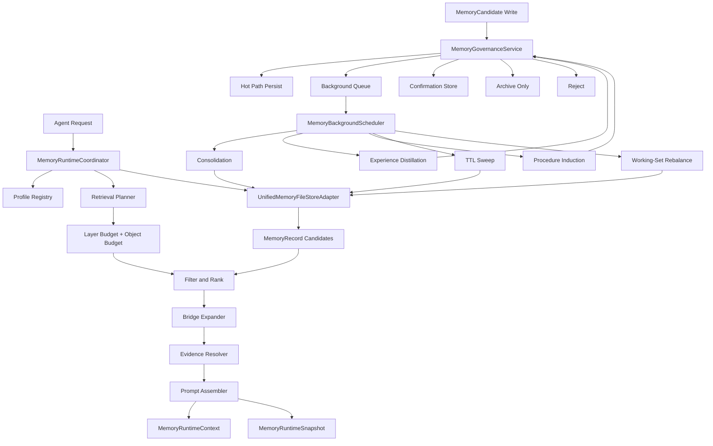
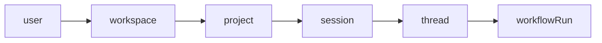
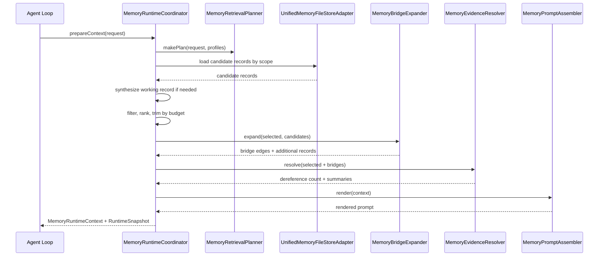
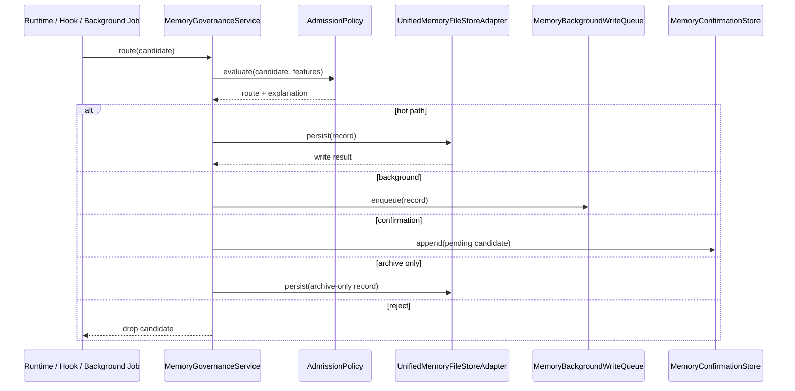
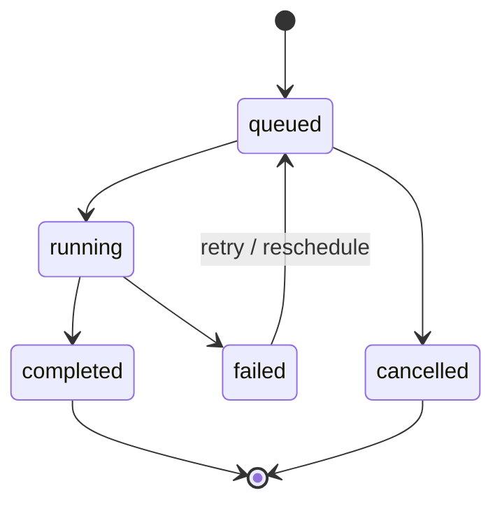

# agentGui Memory 系统新人说明

日期：2026-03-13

## 1. 这套 Memory 在解决什么问题

agentGui 的 memory 不是“把聊天记录压缩一下”这么简单。

它解决的是一个长期运行的 agent 系统都会遇到的问题：

1. 当前轮需要哪些历史信息进入 prompt。
2. 哪些新信息值得写入长期记忆。
3. 哪些信息只是局部噪声，不该污染后续任务。
4. 哪些失败经验、恢复路径、流程套路应该沉淀成可复用知识。
5. 记忆越来越多之后，如何继续保证检索稳定、延迟可控、行为可解释。

所以当前实现已经不是单点功能，而是一套 memory control plane。你可以把它理解成：

1. 有一个统一存储层，保存结构化 `MemoryRecord`。
2. 有一个运行时读取层，在每轮请求前组装本轮最有价值的 memory slice。
3. 有一个治理层，决定什么能直接写、什么要后台写、什么要确认、什么要拒绝。
4. 有一个后台演化层，负责 consolidation、distillation、TTL sweep、working-set rebalance。
5. 有一个观测层，让你看到这轮到底读了什么、排除了什么、为什么这么做。

## 2. 先记住这四个核心对象

新人先不要一上来读全部实现。先记住下面四个核心对象，整个系统就不会迷路。

### 2.1 `MemoryRecord`

它是统一记忆系统的基本单元，表示一条已经落盘或可以落盘的结构化记忆。

它至少包含这些维度：

1. `layer`：记忆层级，例如 `working`、`task`、`semantic`、`episodic`、`proceduralArchive`。
2. `scope`：作用域，例如 `user`、`project`、`session`、`thread`。
3. `verificationStatus`：可信度状态，例如已验证、部分验证、未验证、失败。
4. `retentionPolicy`：保留策略，例如 session bound、persistent、archive only。
5. `evidenceAnchors`：证据锚点，说明这条记忆来自哪些工具调用、文件、消息或验证产物。
6. `admissionExplanation`：准入解释，记录它为什么能进入 memory。
7. `lifecycleTier`：工作集温度，区分 hot、warm、cold、archive。

### 2.2 `MemoryRuntimeCoordinator`

它是 memory 的主入口。每当 agent 需要在一轮执行前准备 memory 上下文时，都是它来：

1. 选 profile。
2. 做 retrieval planning。
3. 过滤、排序、预算裁剪。
4. 做 bridge expansion。
5. 解析 evidence。
6. 生成 prompt。
7. 产出 runtime snapshot。

### 2.3 `MemoryGovernanceService`

它负责写路径治理。不是每条 candidate 都能直接写入 unified store。

它会把 candidate 路由到：

1. `hotPath`
2. `background`
3. `confirmation`
4. `archiveOnly`
5. `reject`

### 2.4 `MemoryBackgroundScheduler`

它负责后台 job。当前会消费这些类型：

1. background write
2. consolidation
3. experience distillation
4. procedure induction
5. working-set rebalance
6. TTL sweep

## 3. 总体架构图

下面这张图是最重要的总览图。先看懂它，再读代码会轻很多。

## 4. 记忆层和作用域怎么理解

### 4.1 Layer 是“内容类型和寿命”的组合

可以先这样理解：

1. `working`：本轮和最近几轮强相关的任务焦点。
2. `task`：对当前任务簇有高价值的事实、恢复路径、失败经验。
3. `semantic`：相对稳定、跨轮复用的知识和偏好。
4. `episodic`：发生过的过程片段，常用于失败链和任务回顾。
5. `proceduralArchive`：抽象出来的 procedure 和套路。
6. `instant`：非常短命的瞬时内容，不适合长期依赖。

### 4.2 Scope 是“谁能看到这条记忆”

不是所有记忆都该跨项目共享，所以系统把作用域单独建模：

这不是严格继承树，而更像检索时的候选范围。通常一轮 retrieval 会把这些 scope 组合起来看，而不是只看一个层级。

## 5. 读路径：一轮请求是怎么拿到 memory slice 的

下面是当前“读取路径”的真实执行顺序。

这条路径里最容易被新人忽略的三点是：

1. 系统在没有现成 `working` record 时会自动合成一条“当前任务焦点”。
2. 进入 prompt 的不只是排序后的记录，还可能包含 bridge 扩展出来的补充记录。
3. 每轮都会生成 snapshot，所以这是可观测、可回放、可调试的，不是黑盒检索。

## 6. 写路径：新记忆不是直接落盘的

新人的常见误解是“只要有 candidate 就会写入 store”。实际不是。

当前写路径经过显式治理：

当前 admission 解释至少会告诉你：

1. 评分路由是什么。
2. feature vector 是什么。
3. 为什么它被接收、延迟、归档或拒绝。

这也是为什么 `MemoryRecord` 里要保存 `admissionExplanation`，因为它不仅是运行时决策，还要用于事后审计和 UI 展示。

## 7. 后台任务：memory 不是一次写完就结束

memory 的价值很大一部分来自后台演化，而不是前台瞬时写入。

### 7.1 当前后台任务有哪些

1. `backgroundWrite`：把异步写入真正落盘。
2. `consolidation`：把 outcome 提升成更高价值的 memory candidate。
3. `experienceDistillation`：从失败链和成功轨迹里蒸馏策略经验。
4. `procedureInduction`：把重复出现的成功模式抽象成 procedure。
5. `ttlSweep`：清理过期 session-bound 内容。
6. `workingSetRebalance`：根据生命周期规则重新分配 hot/warm/cold。

### 7.2 后台 job 状态图

### 7.3 为什么要有 distillation

coding agent 的高价值长期记忆，很多不是“事实”，而是：

1. 某类失败模式经常由什么原因触发。
2. 某类恢复动作在什么场景下有效。
3. 某个工具链的验证顺序应该怎样做。

所以后台层不只是归档，而是在做经验蒸馏和 procedure 学习。

## 8. Bridge 和 Evidence 是这一版最容易低估的两个点

### 8.1 Bridge 是解决“记忆断链”问题的

很多 coding 问题不是靠单条 fact 就能解释清楚，而是要把这些东西连起来：

1. 某个错误。
2. 某个失败尝试。
3. 某个恢复建议。
4. 某个验证成功的实例。

`MemoryBridgeExpander` 就是在做这件事。当前实现还比较浅，但方向已经明确：命中失败相关记录时，会追出恢复路径或 procedure 候选，而不是只把原记录塞进 prompt。

### 8.2 Evidence 是解决“为什么我该信这条记忆”问题的

`MemoryEvidenceAnchor` 让上层记忆可以追溯到：

1. 工具调用
2. 消息
3. 文件
4. 验证产物

这件事对新人特别重要，因为以后调 memory 质量时，第一反应不应该是“调 embedding”或“再加阈值”，而应该先问：

1. 这条长期记忆有没有证据支撑。
2. 证据是不是过时了。
3. 证据和当前问题之间是不是缺 bridge。

## 9. 生命周期管理：TTL 之外还要管 working set

系统现在不只是做 TTL sweep，还会做 `lifecycleTier` 重平衡。

当前可以这样理解：

1. `hot`：很可能直接进入 prompt。
2. `warm`：默认不直接进 prompt，但检索优先级高。
3. `cold`：只在更具体的查询或 bridge 扩展时考虑。
4. `archive`：保留审计价值，不作为默认检索候选。

一个非常实用的经验是：

1. 已验证、高访问、近期有效的记录应该尽量保持 hot。
2. 低可信、低访问、旧记录要尽快降到 cold。
3. 生命周期管理的目标不是“尽量不删”，而是“在稳定预算下保住最值钱的工作集”。

## 10. 新人应该先看哪些文件

如果你想快速建立心智模型，建议按这个顺序读：

1. `agentGui/Models/MemoryRecord.swift`
2. `agentGui/Models/MemoryRuntimeTypes.swift`
3. `agentGui/Services/MemoryRuntimeCoordinator.swift`
4. `agentGui/Services/MemoryRetrievalPlanner.swift`
5. `agentGui/Services/MemoryGovernanceService.swift`
6. `agentGui/Services/MemoryBackgroundScheduler.swift`
7. `agentGui/Services/MemoryConsolidationEngine.swift`
8. `agentGui/ViewModels/MemoryManagementViewModel.swift`
9. `agentGui/ViewModels/MemoryRuntimeSnapshotViewModel.swift`
10. `agentGui/Views/Settings/SettingsMemoryView.swift`

如果你是为了改行为而不是理解架构，建议先读这些测试：

1. `agentGuiTests/MemoryRuntimeCoordinatorTests.swift`
2. `agentGuiTests/MemoryGovernanceServiceTests.swift`
3. `agentGuiTests/MemoryGovernedWriteRoutingTests.swift`
4. `agentGuiTests/MemoryConsolidationEngineTests.swift`
5. `agentGuiTests/MemoryBackgroundSchedulerTests.swift`
6. `agentGuiTests/MemoryRetentionServiceTests.swift`

## 11. 设置页里的 rollout 开关是什么意思

当前 memory 子系统不是一次性全开，而是支持逐步 rollout。设置页里这些开关的含义如下：

1. `enableUnifiedMemoryRuntime`：是否启用统一读取路径。
2. `enableMemoryGovernance`：是否启用治理层。
3. `enableAdmissionV2`：是否启用新的准入评分路径。
4. `enableGoalConditionedRetrieval`：是否启用 goal-conditioned retrieval。
5. `enableBridgeExpansion`：是否启用 bridge 扩展。
6. `enableLifecycleManager`：是否启用 working-set lifecycle 管理。
7. `enableExperienceDistillation`：是否启用经验蒸馏与 procedure 学习。

对新人来说，这些开关很重要，因为当你排查“为什么这轮没读到”“为什么这条没写进去”时，先确认功能是不是被开关关闭了。

## 12. 观测与排错：先看哪里

### 12.1 如果问题是“为什么没读到这条记忆”

先看 runtime snapshot：

1. 候选 scope 有没有包含它。
2. layer 是否在当前 plan 里。
3. 是否被 budget trim。
4. 是否因为 archived / superseded 被排除。
5. bridge 扩展是否缺失。

### 12.2 如果问题是“为什么这条写进去了”

先看 admission explanation：

1. score route 是什么。
2. reasons 是什么。
3. feature vector 有没有明显不合理。

### 12.3 如果问题是“为什么这条后来不见了”

重点查三类后台行为：

1. TTL sweep
2. archive-only 路由
3. lifecycle rebalance

## 13. 一句话理解当前 memory

如果你要把当前 agentGui memory 用一句话讲给新人听，可以直接说：

> 它是一套“证据支撑、按目标检索、按价值准入、可后台演化、可完整观测”的统一记忆控制面，而不是单纯的聊天摘要或向量检索层。

这句话基本覆盖了当前实现最重要的设计方向。
