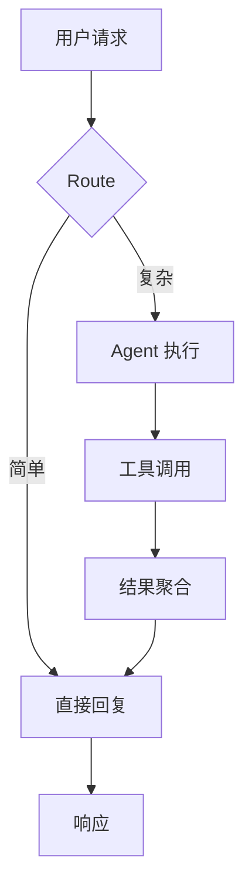

# Feature M-1: Mermaid 自适应高度渲染 Implementation Plan

> **For Claude:** REQUIRED SUB-SKILL: Use superpowers:executing-plans to implement this plan task-by-task.

**Goal:** 将 `MermaidBlockView` 中固定的 250px 高度替换为根据图表真实宽高比自动计算的动态高度，渲染期间显示骨架屏占位。

**Architecture:** 引入 `MermaidRenderState` 枚举作为视图状态机；新增 `MermaidAsyncRenderer` actor 将同步的 `MermaidRenderer.renderImage()` 转至后台执行；`MermaidBlockView` 通过 `.task(id:)` 触发渲染，用 SwiftUI `Image(nsImage:)` 替代 `NSViewRepresentable`，高度由 `diagramWidth * (imageSize.height / imageSize.width)` 动态计算。

**Tech Stack:** Swift 6 · SwiftUI · BeautifulMermaid 1.0.1（`MermaidRenderer.renderImage(source:theme:scale:)`）· Swift Testing（`@Test` / `#expect`）

---

## 背景知识

### BeautifulMermaid 渲染 API
```swift
// 同步渲染，抛出错误而非返回 nil 来表达失败
// 返回 NSImage（macOS），image.size 为逻辑点（pt），已考虑 scale
let image: NSImage? = try MermaidRenderer.renderImage(
    source: mermaidCode,
    theme: .zincDark,
    scale: 2.0        // Retina，默认值
)
// image.size.width / image.size.height = 图表宽高比
```

### 当前问题代码（MermaidBlockView.swift 第 82-87 行）
```swift
HorizontalScrollView(showsIndicators: true) {
    MermaidNSView(source: source, theme: theme)
        .frame(width: diagramWidth, height: 250)   // ← 固定 250px
        .padding(8)
}
```

### SkeletonBlock 用法（已存在于 agentGui/Views/SkeletonBlock.swift）
```swift
SkeletonBlock(height: 200)   // width 为 nil 时填满父容器宽度
```

---

## Task 1：定义 MermaidRenderState 枚举

**文件：**
- 修改：`agentGui/Views/MermaidBlockView.swift`

**说明：** 在文件顶部（`import` 之后、`MermaidNSView` 之前）插入枚举。M-2 会补充 `.failure` 分支的 UI，此处只需定义完整枚举。

**Step 1：在 MermaidBlockView.swift 中添加枚举**

在 `// MARK: - Mermaid Diagram View` 注释之后、`struct MermaidNSView` 之前插入：

```swift
// MARK: - Render State

enum MermaidRenderState: Equatable {
    case loading
    case success(NSImage, CGFloat)   // image, aspectRatio (width/height)
    case failure(String)             // error description
}
```

**Step 2：验证文件编译**

```bash
cd /Volumes/T7/文稿/Projects/agentGui
xcodebuild build \
  -project agentGui.xcodeproj \
  -scheme agentGui \
  -destination "platform=macOS" \
  CODE_SIGNING_ALLOWED=NO \
  2>&1 | grep -E "error:|Build succeeded"
```

**期望输出：** `Build succeeded`

**Step 3：Commit**

```bash
git add agentGui/Views/MermaidBlockView.swift
git commit -m "feat(mermaid-m1): add MermaidRenderState enum"
```

---

## Task 2：新增 MermaidAsyncRenderer actor

**文件：**
- 修改：`agentGui/Views/MermaidBlockView.swift`（添加到 `MermaidRenderState` 枚举之后）
- 测试：`agentGuiTests/MermaidAsyncRendererTests.swift`（新建）

**说明：** `MermaidRenderer.renderImage()` 是同步且 CPU 密集的方法（ELK 布局计算），需在后台 actor 上执行避免阻塞主线程。

**Step 1：在 MermaidBlockView.swift 中插入 actor**

在 `MermaidRenderState` 枚举定义之后添加：

```swift
// MARK: - Async Renderer

actor MermaidAsyncRenderer {
    /// Renders Mermaid source to an image on the actor's executor (off main thread).
    /// - Returns: `(image, aspectRatio)` where aspectRatio = width / height
    /// - Throws: Any error thrown by MermaidRenderer (parse/layout errors)
    func render(
        source: String,
        theme: DiagramTheme,
        scale: CGFloat = 2.0
    ) async throws -> (NSImage, CGFloat) {
        guard let image = try MermaidRenderer.renderImage(
            source: source,
            theme: theme,
            scale: scale
        ) else {
            throw MermaidRenderError.emptyResult
        }
        let size = image.size
        guard size.width > 0, size.height > 0 else {
            throw MermaidRenderError.invalidSize(size)
        }
        let aspectRatio = size.width / size.height
        return (image, aspectRatio)
    }
}

enum MermaidRenderError: Error, LocalizedError {
    case emptyResult
    case invalidSize(CGSize)

    var errorDescription: String? {
        switch self {
        case .emptyResult:
            return "图表渲染返回空结果"
        case .invalidSize(let size):
            return "图表尺寸无效：\(size.width) × \(size.height)"
        }
    }
}
```

**Step 2：新建测试文件**

创建 `agentGuiTests/MermaidAsyncRendererTests.swift`：

```swift
import AppKit
import Testing
@testable import agentGui

struct MermaidAsyncRendererTests {

    private let renderer = MermaidAsyncRenderer()

    // MARK: - 正常图表

    @Test
    func flowchartRendersSuccessfully() async throws {
        let source = """
        graph TD
            A[Start] --> B[End]
        """
        let (image, aspectRatio) = try await renderer.render(source: source, theme: .zincLight)

        #expect(image.size.width > 0)
        #expect(image.size.height > 0)
        #expect((0.1...10.0).contains(aspectRatio),
                "宽高比应在合理范围内，实际：\(aspectRatio)")
    }

    @Test
    func sequenceDiagramRendersSuccessfully() async throws {
        let source = """
        sequenceDiagram
            Alice->>Bob: 你好
            Bob-->>Alice: 你好
        """
        let (image, aspectRatio) = try await renderer.render(source: source, theme: .zincDark)

        #expect(image.size.width > 0)
        #expect(image.size.height > 0)
        #expect((0.1...10.0).contains(aspectRatio))
    }

    @Test
    func aspectRatioMatchesImageDimensions() async throws {
        let source = "graph LR; A --> B"
        let (image, aspectRatio) = try await renderer.render(source: source, theme: .zincLight)
        let expected = image.size.width / image.size.height
        #expect(abs(aspectRatio - expected) < 0.001)
    }

    // MARK: - 错误输入

    @Test
    func invalidSourceThrows() async {
        let source = "%%% 完全无效的语法 %%%"
        // BeautifulMermaid 对无效输入可能返回 nil 或 throws
        // 两种情况都不应崩溃
        do {
            let (image, _) = try await renderer.render(source: source, theme: .zincLight)
            // 若未抛出，验证至少返回了有意义的占位图
            #expect(image.size.width >= 0)
        } catch {
            // 抛出错误也是可接受的，确认是 MermaidRenderError
            #expect(error is MermaidRenderError || error is any Error)
        }
    }

    @Test
    func emptySourceThrowsOrReturnsEmpty() async {
        do {
            _ = try await renderer.render(source: "", theme: .zincLight)
            Issue.record("空 source 应抛出错误")
        } catch {
            // 期望抛出
            #expect(error is MermaidRenderError)
        }
    }
}
```

**Step 3：运行测试，确认失败（找不到 MermaidAsyncRenderer）**

```bash
cd /Volumes/T7/文稿/Projects/agentGui
xcodebuild test \
  -project agentGui.xcodeproj \
  -scheme agentGui \
  -destination "platform=macOS" \
  -parallel-testing-enabled NO \
  -derivedDataPath /tmp/agentGui-m1-task2 \
  -only-testing:agentGuiTests/MermaidAsyncRendererTests \
  CODE_SIGNING_ALLOWED=NO \
  2>&1 | tail -20
```

**Step 4：Task 1 与 Task 2 的实现已在同一文件 — 验证编译**

```bash
xcodebuild build \
  -project agentGui.xcodeproj \
  -scheme agentGui \
  -destination "platform=macOS" \
  CODE_SIGNING_ALLOWED=NO \
  2>&1 | grep -E "error:|Build succeeded"
```

**Step 5：运行测试，确认通过**

```bash
xcodebuild test \
  -project agentGui.xcodeproj \
  -scheme agentGui \
  -destination "platform=macOS" \
  -parallel-testing-enabled NO \
  -derivedDataPath /tmp/agentGui-m1-task2 \
  -only-testing:agentGuiTests/MermaidAsyncRendererTests \
  CODE_SIGNING_ALLOWED=NO \
  2>&1 | grep -E "Test.*passed|Test.*failed|error:"
```

**期望输出：**
```
Test suite 'MermaidAsyncRendererTests' passed
```

**Step 6：Commit**

```bash
git add agentGui/Views/MermaidBlockView.swift agentGuiTests/MermaidAsyncRendererTests.swift
git commit -m "feat(mermaid-m1): add MermaidAsyncRenderer actor + tests"
```

---

## Task 3：改造 MermaidBlockView 为异步渲染 + 动态高度

**文件：**
- 修改：`agentGui/Views/MermaidBlockView.swift`

**说明：**
1. 移除 `MermaidNSView`（NSViewRepresentable），改用 `Image(nsImage:)`
2. 添加 `@State private var renderState: MermaidRenderState = .loading`
3. 添加 `@State private var renderer = MermaidAsyncRenderer()`
4. 工具栏宽度步进器保留（用户仍可调整显示宽度）
5. diagram 区域：loading → `SkeletonBlock`；success → `Image(nsImage:)` 按比例高度；failure → 空白（M-2 完善）

**Step 1：完整替换 MermaidBlockView 的 body 和状态**

定位到 `struct MermaidBlockView: View {` 并替换整个结构体（保留 `MermaidNSView` 待 M-2 确认可删除之前，先注释掉）。

将现有 `MermaidBlockView` 替换为：

```swift
struct MermaidBlockView: View {
    let source: String
    @Environment(\.colorScheme) private var colorScheme
    @SwiftUI.State private var showSource = false
    @SwiftUI.State private var diagramWidth: CGFloat = 600
    @SwiftUI.State private var renderState: MermaidRenderState = .loading
    @SwiftUI.State private var renderer = MermaidAsyncRenderer()

    private var theme: DiagramTheme {
        colorScheme == .dark ? .zincDark : .zincLight
    }

    var body: some View {
        VStack(alignment: .leading, spacing: 0) {
            toolbar
            Divider()
            content
        }
        .background(.regularMaterial)
        .clipShape(RoundedRectangle(cornerRadius: 10))
        .overlay(
            RoundedRectangle(cornerRadius: 10)
                .stroke(Color.primary.opacity(0.08), lineWidth: 1)
        )
        .task(id: source + (colorScheme == .dark ? "dark" : "light")) {
            await triggerRender()
        }
    }

    // MARK: - Sub-views

    @ViewBuilder
    private var toolbar: some View {
        HStack(spacing: 8) {
            Text("mermaid")
                .font(.caption)
                .foregroundStyle(.secondary)
            Spacer()
            if !showSource {
                widthStepper
            }
            sourceToggleButton
        }
        .padding(.horizontal, 12)
        .padding(.vertical, 6)
        .background(.ultraThinMaterial)
    }

    private var widthStepper: some View {
        HStack(spacing: 2) {
            Button { diagramWidth = max(200, diagramWidth - 100) } label: {
                Image(systemName: "minus").font(.caption)
            }
            .buttonStyle(.plain)
            Text("\(Int(diagramWidth))px")
                .font(.caption)
                .foregroundStyle(.secondary)
                .frame(minWidth: 50)
            Button { diagramWidth = min(1600, diagramWidth + 100) } label: {
                Image(systemName: "plus").font(.caption)
            }
            .buttonStyle(.plain)
        }
        .padding(.horizontal, 6)
        .padding(.vertical, 2)
        .background(Color.primary.opacity(0.05))
        .clipShape(RoundedRectangle(cornerRadius: 5))
    }

    private var sourceToggleButton: some View {
        Button {
            withAnimation(.easeInOut(duration: 0.15)) { showSource.toggle() }
        } label: {
            Label(showSource ? "图表" : "源码",
                  systemImage: showSource ? "chart.xyaxis.line" : "chevron.left.forwardslash.chevron.right")
                .font(.caption)
                .foregroundStyle(.secondary)
        }
        .buttonStyle(.plain)
    }

    @ViewBuilder
    private var content: some View {
        if showSource {
            sourceView
        } else {
            diagramView
        }
    }

    private var sourceView: some View {
        HorizontalScrollView(showsIndicators: false) {
            Text(source.trimmingCharacters(in: .newlines))
                .font(.system(.footnote, design: .monospaced))
                .textSelection(.enabled)
                .padding(12)
                .frame(maxWidth: .infinity, alignment: .leading)
        }
    }

    @ViewBuilder
    private var diagramView: some View {
        switch renderState {
        case .loading:
            SkeletonBlock(height: 200)
                .padding(8)

        case .success(let image, let aspectRatio):
            let height = diagramWidth / aspectRatio
            HorizontalScrollView(showsIndicators: true) {
                Image(nsImage: image)
                    .resizable()
                    .aspectRatio(contentMode: .fit)
                    .frame(width: diagramWidth, height: height)
                    .padding(8)
            }

        case .failure:
            // M-2 will implement the error UI; show minimal placeholder for now
            SkeletonBlock(height: 60)
                .padding(8)
        }
    }

    // MARK: - Rendering

    @MainActor
    private func triggerRender() async {
        renderState = .loading
        do {
            let (image, aspectRatio) = try await renderer.render(
                source: source,
                theme: theme
            )
            renderState = .success(image, aspectRatio)
        } catch {
            renderState = .failure(error.localizedDescription)
        }
    }
}
```

**Step 2：删除不再需要的 MermaidNSView**

将 `struct MermaidNSView: NSViewRepresentable { ... }` 整体删除（已被完全取代）。

**Step 3：验证编译**

```bash
cd /Volumes/T7/文稿/Projects/agentGui
xcodebuild build \
  -project agentGui.xcodeproj \
  -scheme agentGui \
  -destination "platform=macOS" \
  CODE_SIGNING_ALLOWED=NO \
  2>&1 | grep -E "error:|warning.*MermaidNSView|Build succeeded"
```

**期望输出：** `Build succeeded`（以及 0 个 error）

**Step 4：Commit**

```bash
git add agentGui/Views/MermaidBlockView.swift
git commit -m "feat(mermaid-m1): replace fixed-height NSViewRepresentable with async image rendering"
```

---

## Task 4：补充 Equatable 支持 & 处理 source 实时更新

**文件：**
- 修改：`agentGui/Views/MermaidBlockView.swift`

**说明：** `NSImage` 不遵循 `Equatable`，`MermaidRenderState` 上的 `Equatable` 声明会导致编译错误。需要自定义实现。同时确认流式消息 source 变化时能正确重渲染（`.task(id:)` 已处理，但要确认 Task 取消）。

**Step 1：为 MermaidRenderState 添加自定义 Equatable**

将枚举声明改为：

```swift
enum MermaidRenderState {
    case loading
    case success(NSImage, CGFloat)
    case failure(String)
}

extension MermaidRenderState: Equatable {
    static func == (lhs: MermaidRenderState, rhs: MermaidRenderState) -> Bool {
        switch (lhs, rhs) {
        case (.loading, .loading):
            return true
        case (.success(_, let la), .success(_, let ra)):
            // Compare by aspect ratio only; sufficient for preventing spurious re-renders
            return abs(la - ra) < 0.001
        case (.failure(let lm), .failure(let rm)):
            return lm == rm
        default:
            return false
        }
    }
}
```

**Step 2：确认取消行为——`.task(id:)` 触发重渲染时取消上一个 Task**

`.task(id:)` 在 id 变化时会自动取消现有任务，无需额外代码。只需验证 `triggerRender()` 是 `async` 且可被 cooperative cancellation 中断即可（`MermaidRenderer.renderImage` 是纯计算，不 checkpoint；但 actor 切换提供了取消检查点）。

在 `triggerRender()` 中插入早退检查：

```swift
@MainActor
private func triggerRender() async {
    renderState = .loading
    do {
        try Task.checkCancellation()  // ← 新增：source 快速变化时跳过过期渲染
        let (image, aspectRatio) = try await renderer.render(
            source: source,
            theme: theme
        )
        try Task.checkCancellation()  // ← 新增：渲染完成后检查是否仍需要结果
        renderState = .success(image, aspectRatio)
    } catch is CancellationError {
        // 任务已取消，保持 loading（下一个 task 会接管）
    } catch {
        renderState = .failure(error.localizedDescription)
    }
}
```

**Step 3：验证编译**

```bash
xcodebuild build \
  -project agentGui.xcodeproj \
  -scheme agentGui \
  -destination "platform=macOS" \
  CODE_SIGNING_ALLOWED=NO \
  2>&1 | grep -E "error:|Build succeeded"
```

**Step 4：Commit**

```bash
git add agentGui/Views/MermaidBlockView.swift
git commit -m "feat(mermaid-m1): fix Equatable + add cancellation checkpoints"
```

---

## Task 5：端到端冒烟验证

**说明：** 这是手动验证步骤，确保 UI 行为符合预期。

**Step 1：在 Xcode 中运行 App**

1. 在 Xcode 中打开 `agentGui.xcodeproj`
2. 运行 App（Cmd+R）
3. 打开一个已有会话或创建新会话
4. 发送包含如下 Mermaid 代码的消息（或从历史记录中找）：

````

````

**预期行为：**
- [ ] 消息渲染时先短暂显示骨架屏（shimmer 动画）
- [ ] 骨架屏过渡为图表图片，高度自动匹配图表内容（不截断，不过多留白）
- [ ] ±100px 宽度按钮仍可调整宽度，高度随之等比变化
- [ ] 切换"源码"仍正常显示
- [ ] Dark/Light 模式切换后自动重新渲染

**Step 2：运行完整测试套件确认无回归**

```bash
xcodebuild test \
  -project agentGui.xcodeproj \
  -scheme agentGui \
  -destination "platform=macOS" \
  -parallel-testing-enabled NO \
  -derivedDataPath /tmp/agentGui-m1-final \
  -only-testing:agentGuiTests/MermaidAsyncRendererTests \
  CODE_SIGNING_ALLOWED=NO \
  2>&1 | grep -E "Test.*passed|Test.*failed|error:"
```

**Step 3：最终 Commit**

```bash
git add -A
git commit -m "feat(mermaid-m1): adaptive height rendering complete"
```

---

## 实现后的文件结构

```
agentGui/Views/MermaidBlockView.swift
├── MermaidRenderState (enum)          ← Task 1
├── MermaidAsyncRenderer (actor)       ← Task 2
├── MermaidRenderError (enum)          ← Task 2
└── MermaidBlockView (struct View)     ← Task 3/4
    ├── toolbar (computed var)
    ├── widthStepper (computed var)
    ├── sourceToggleButton (computed var)
    ├── content (ViewBuilder)
    ├── sourceView (computed var)
    ├── diagramView (ViewBuilder)       ← 动态高度在此
    └── triggerRender() async          ← 用 .task(id:) 触发

agentGuiTests/MermaidAsyncRendererTests.swift  ← Task 2
```

---

## 注意事项

1. **`NSImage` 不是 Sendable** — `MermaidAsyncRenderer` actor 的 `render()` 返回 `NSImage`，在从 actor 传回 `@MainActor` 时会有 Swift 6 sendability 警告。如果触发编译错误，改为在 MainActor 上调用 `MermaidImageRenderer` 而不是后台 actor（性能影响小，可接受）：

   ```swift
   // 备选方案：直接在 MainActor 同步渲染（避免 Sendable 问题）
   @MainActor
   private func triggerRender() async {
       renderState = .loading
       do {
           guard let image = try MermaidRenderer.renderImage(source: source, theme: theme) else {
               renderState = .failure("渲染返回空结果")
               return
           }
           let aspectRatio = image.size.width / image.size.height
           renderState = .success(image, aspectRatio)
       } catch {
           renderState = .failure(error.localizedDescription)
       }
   }
   ```

2. **宽度步进后高度更新** — `diagramWidth` 变化不触发重渲染（`.task(id:)` 的 id 不含 width），只会影响 `height = diagramWidth / aspectRatio` 的计算。由于 `aspectRatio` 已存在于状态，SwiftUI 会自动重算 `height`，行为正确。

3. **`BeautifulMermaid` 的 xychart-beta** — XY Chart 图表在 1.0.1 中对某些语法返回 `nil` 而非抛出错误，`MermaidRenderError.emptyResult` 会捕获此情况。
