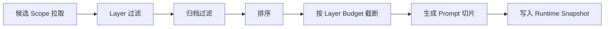
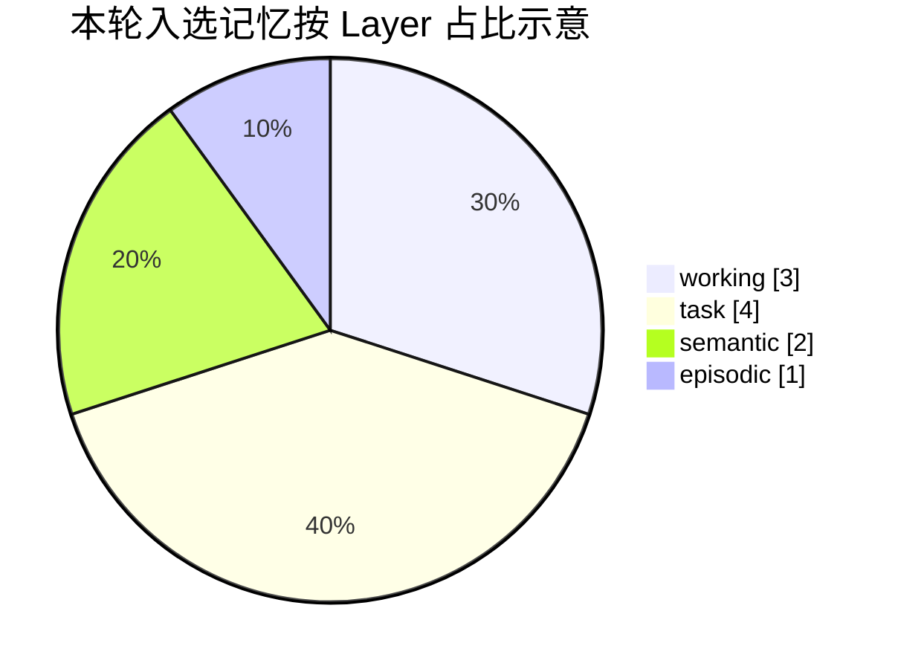
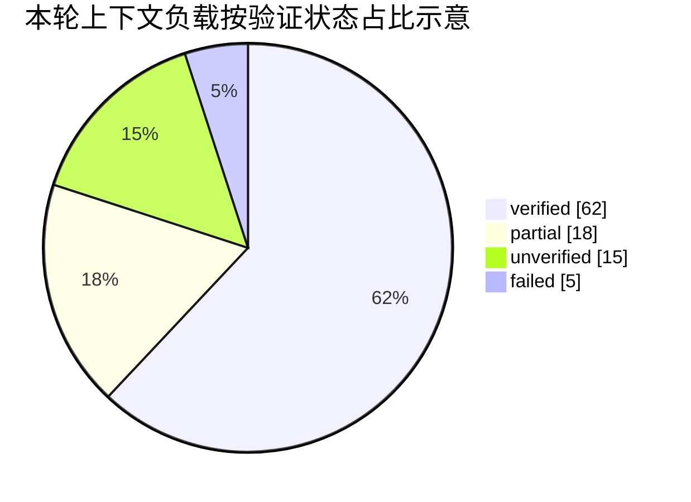

# 统一记忆运行时上下文可观测性需求说明

日期：2026-03-11

关联对象：`MemoryRuntimeCoordinator`、`MemoryRetrievalPlanner`、`MemoryPromptAssembler`、`MemoryRuntimeContext`、`UnifiedMemoryFileStoreAdapter`、`ToolCall`、`AgentRound`、聊天消息详情面板、记忆治理面板

## 1. 背景

当前统一记忆架构已经具备基础运行能力：

- `MemoryRuntimeCoordinator.prepareContext(for:)` 会根据 `MemoryRuntimeRequest` 选择 profile、生成 retrieval plan、收集 records、按 layer 做预算裁剪，并输出 `MemoryRuntimeContext`
- `MemoryPromptAssembler` 会把进入上下文的 records 渲染成 `已验证事实 / 当前推测 / 相关事件 / 风险与待确认项`
- `ClaudeService+AgenticLoop` 会在工具调用记录中保存 `memoryRuntimeProfiles`、`memoryRuntimeLayers`、`memoryRuntimeWarnings`
- `MemoryManagementPanel` 可以看到统一存储库的全量统计，例如总记录数、按 scope 统计、按 layer 统计

但当前仍然存在关键观测缺口：

- 无法查看某一轮实际注入 prompt 的具体记忆条目
- 无法区分“候选记录”与“最终入选记录”
- 无法看到哪些记录因为 layer 不匹配、归档、预算裁剪而被排除
- 无法看到不同类型记忆在本轮上下文中的占比
- 无法判断当前上下文预算主要被哪类记忆消耗

这会直接带来三个问题：

- 调试困难：开发者无法回答“模型这轮到底看到了什么记忆”
- 体验不透明：用户知道统一记忆开启了，但不知道它是否真的生效
- 策略无法校准：预算权重、layer 顺序、profile 路由缺少可视化反馈闭环

因此，需要为统一记忆运行时补齐一套“上下文可观测性”能力，让系统能够展示每轮注入内容、聚合统计和占比图表。

## 2. 目标

本需求的目标如下：

- 让用户和开发者都能查看某一轮真正注入上下文的记忆内容
- 让系统明确展示记忆从“候选”到“入选”的筛选过程
- 让不同类型记忆以图表形式展示条目占比与上下文占比
- 让运行时观测聚焦“本轮上下文切片”，而不是仅展示全库静态统计
- 为后续预算调参、profile 调优、记忆质量审计提供事实依据

## 3. 不在本次范围

- 不在本次内重写统一记忆的 retrieval 策略
- 不在本次内引入向量检索、embedding 可视化或语义距离分析
- 不要求本次变更 `MemoryPromptAssembler` 的文案组织方式
- 不要求直接改动记忆治理、冲突解决和后台巩固规则
- 不要求新增云端遥测或远程分析平台

## 4. 现状问题定义

### 4.1 只有“元数据级可见”，没有“内容级可见”

当前 `ToolCall` 详情里只能看到：

- `memoryRuntimeProfiles`
- `memoryRuntimeLayers`
- `memoryRuntimeWarnings`

这只能说明“运行时大致启用了什么”，不能说明“具体注入了哪些记录”。

### 4.2 治理面板展示的是全库，不是本轮切片

当前 `MemoryManagementPanel` 的统计基于 `UnifiedMemoryFileStoreAdapter.allRecords(includeArchived: true)`。这适合做治理运营，但不适合回答以下问题：

- 本轮从哪些 scope 拉取了候选记录
- 最终哪些记录进入了 prompt
- 各类型在本轮上下文中的真实占比是多少

### 4.3 预算是存在的，但预算消耗不可解释

当前 `MemoryRetrievalPlanner` 已按 task kind 给出 layer 顺序和预算分配，但用户无法知道：

- 每层原本有多少候选
- 每层实际保留了多少
- 哪些层吃掉了大部分上下文预算
- “条目数占比”和“文本长度占比”是否一致

### 4.4 被过滤掉的记录没有排除原因

当前 `filterAndBudget(records:with:)` 只返回最终结果，不保留排除原因。这导致无法回放：

- 因 layer 不在计划中被过滤
- 因 `archiveOnly` 被过滤
- 因预算不足未入选
- 因排序靠后被截断

## 5. 总体方案

### 5.1 核心原则

- 观测对象必须是“单轮运行时快照”，不是全局抽象状态
- 同时展示“原始条目明细”和“聚合统计”
- 同时展示“入选结果”和“排除原因”
- 图表必须基于可解释维度，不得只展示总数
- 数值口径必须清晰区分“条目数占比”和“上下文负载占比”

### 5.2 目标形态

系统需要在每次统一记忆运行时生成一个 `Memory Runtime Snapshot`，该快照作为本轮上下文注入的权威观测对象，至少包含：

- 请求参数摘要
- 命中的 profile
- retrieval plan
- 候选 scopes
- 候选 records
- 入选 records
- 被排除 records 及原因
- 渲染后的 prompt 文本摘要
- 聚合统计与图表数据

## 6. 功能需求

### 功能点 1：为每轮上下文注入生成运行时快照

需求：

- 统一记忆运行时每次执行 `prepareContext(for:)` 时，必须产出一份可持久化快照
- 快照必须与当前会话、线程、工具调用或 agent round 建立关联
- 快照必须能被后续 UI 直接读取，而不是仅存在日志打印中

最低字段要求：

- `snapshotId`
- `sessionId`
- `threadId`
- `workflowRunId`
- `toolCallId` 或 `agentRoundId`
- `createdAt`
- `taskKind`
- `projectId`
- `workspaceRoot`
- `contextBudget`
- `profileIDs`
- `orderedLayers`
- `itemBudgetByLayer`

### 功能点 2：记录候选、入选和排除原因

需求：

- 快照必须区分以下三类集合：
  - 候选记录
  - 最终入选记录
  - 被排除记录
- 对每条被排除记录，必须附带排除原因

排除原因最低枚举要求：

- `layerNotPlanned`
- `archived`
- `budgetTrimmed`
- `rankedOut`
- `duplicateOrSuperseded`
- `other`

每条记录的摘要字段至少包括：

- `recordId`
- `title`
- `summary`
- `layer`
- `kind`
- `scope`
- `domainProfile`
- `verificationStatus`
- `retentionPolicy`
- `source`
- `tags`
- `confidence`
- `createdAt`
- `updatedAt`
- `lastAccessedAt`

### 功能点 3：展示“实际注入上下文”的原始内容明细

需求：

- 用户必须能看到本轮入选的每条记录，而不是只看到最终拼接后的大段文本
- 明细视图必须展示记录标题、摘要、分类字段、来源字段和状态字段
- 明细视图必须支持按以下维度筛选或分组：
  - layer
  - kind
  - scope
  - verificationStatus
  - source
  - retentionPolicy

明细视图至少应包含两个视角：

- 视角 A：按“最终 prompt 顺序”查看
- 视角 B：按“类型分组”查看

### 功能点 4：展示筛选链路和预算链路

需求：

- 系统必须可视化展示本轮记忆筛选流程
- 用户必须能看到每个阶段的数量变化

最低阶段包括：

- scope 拉取后候选总数
- layer 过滤后数量
- 归档过滤后数量
- 排序后数量
- 按 budget 截断后最终数量

展示要求：

- 必须展示每层预算值与实际入选值
- 必须展示“该层候选数 > 预算值”时发生了裁剪
- 若某层候选数为 0，也必须显式展示，避免误判为系统缺失数据

### 功能点 5：按不同类型展示占比图表

需求：

- 系统必须提供图表，展示本轮入选上下文中不同类型记忆的占比
- 图表至少支持以下维度切换：
  - 按 `layer`
  - 按 `kind`
  - 按 `scope`
  - 按 `verificationStatus`
  - 按 `source`

每个维度至少要提供两种占比口径：

- 条目数占比
- 上下文负载占比

说明：

- “条目数占比”表示该类型入选记录数 / 本轮入选总记录数
- “上下文负载占比”表示该类型渲染文本长度或 token 估算 / 本轮总渲染长度或 token 估算
- 如果当前阶段没有可靠 tokenizer，本期允许先采用“字符数估算”，但 UI 中必须明确标注为“估算值”

### 功能点 6：在现有聊天链路中提供查看入口

需求：

- 用户必须能从当前聊天使用链路进入本轮记忆快照
- 至少提供以下两个入口之一，推荐同时提供：
  - 工具调用详情中的“记忆上下文快照”入口
  - Agent Round / 消息详情中的“本轮注入记忆”入口

交互要求：

- 如果本轮未启用统一记忆，入口应显示为不可用并说明原因
- 如果本轮启用了统一记忆但未命中任何记录，应显示“命中为 0”的空态，而不是不显示模块

### 功能点 7：补充独立的运行时观测面板

需求：

- 在治理面板之外，系统必须新增一个面向“单轮运行时”的观测面板
- 该面板与全库治理页职责分离，不应混用为同一页面

该面板至少包含以下区域：

- 概览区：任务类型、profile、scope 来源、总候选、总入选、总排除、预算值
- 图表区：各维度占比图、预算使用图
- 明细区：入选记录列表、排除记录列表
- Prompt 区：最终渲染文本预览

## 7. 图表与可视化要求

### 7.1 图表类型要求

本期至少应包含以下图表：

- 饼图：展示某个维度的占比
- 横向预算图或列表图：展示每个 layer 的预算值、候选值、入选值
- 流程图或漏斗图：展示筛选链路

### 7.2 图表交互要求

- 图表点击后必须能联动下方明细列表
- 切换维度时，明细列表必须同步刷新
- 图表 hover 或选中状态必须显示：类型名称、记录数、占比、估算负载

### 7.3 示例图一：上下文筛选链路示意

### 7.4 示例图二：按 Layer 的入选占比示意

### 7.5 示例图三：按验证状态的上下文负载占比示意

## 8. 数据口径要求

### 8.1 条目数口径

- 分子：某类型入选记录数
- 分母：本轮入选记录总数
- 若分母为 0，则图表显示空态，不允许显示伪 100%

### 8.2 上下文负载口径

- 分子：某类型记录渲染到 prompt 的文本长度或 token 估算值
- 分母：本轮所有入选记录渲染后的总长度或总 token 估算值
- 若系统仍以字符数估算，则 UI 必须明确写为“字符占比（估算）”

### 8.3 预算口径

- `planner budget`：`MemoryRetrievalPlanner` 为各 layer 计算的目标预算
- `candidate count`：该层在过滤前或预算前的候选数量
- `selected count`：该层最终入选数量
- 若 `selected count < planner budget`，不应视为异常，而应视为“候选不足”

## 9. 推荐信息架构

### 9.1 页面结构

推荐在“单轮记忆上下文观测面板”中采用以下布局：

- 顶部摘要栏
- 中部图表栏
- 底部双列表
- 右侧或下方 Prompt 预览区

推荐摘要栏字段：

- 任务类型
- session / thread / workflowRun
- profile 列表
- scope 列表
- contextBudget
- candidate 数
- selected 数
- excluded 数
- rendered prompt 长度

### 9.2 明细列表字段

入选记录列表至少展示：

- 标题
- 摘要
- layer
- kind
- scope
- source
- verificationStatus
- retentionPolicy
- tags
- 估算长度
- 在 prompt 中的顺序位置

排除记录列表至少展示：

- 标题
- layer
- scope
- 排除原因
- 若因预算裁剪被排除，应展示该层预算与该记录排名位置

## 10. 实现要求

### 10.1 运行时数据生成

要求：

- 不允许仅依赖控制台日志完成本需求
- 运行时快照必须是结构化数据，可被 SwiftUI 直接消费
- 快照持久化策略可以是 SwiftData、JSON 文件或挂接在现有模型上，但必须满足可查询和可回放

### 10.2 与现有模型的关系

要求：

- 当前 `ToolCall` 上已有的 `memoryRuntimeProfiles / Layers / Warnings` 应继续保留，作为轻量摘要
- 新增快照能力后，`ToolCall` 或 `AgentRound` 至少需要能关联到具体快照 ID
- 不应把完整快照硬塞进现有字符串字段中

### 10.3 性能要求

要求：

- 快照生成不得显著拖慢主对话首 token 时间
- 图表统计应优先复用快照生成时的预聚合数据，避免 UI 层重复全量扫描
- 单轮快照浏览应优先读取本轮数据，不得把全库扫描作为默认路径

## 11. 验收标准

满足以下条件时，可视为本需求完成：

- 启用统一记忆后，用户可以在某一轮消息或工具详情中打开“记忆上下文快照”
- 页面可以列出本轮实际注入的具体记录
- 页面可以区分候选、入选和排除记录
- 页面可以展示至少两类占比图表，并支持维度切换
- 页面可以展示每层预算值、候选值、入选值
- 页面可以预览最终渲染的记忆 prompt 文本
- 页面在“无命中”“未启用”“预算为 0”场景下都有明确空态或说明

## 12. 风险与注意事项

- 当前 `contextBudget` 以 `budget / 1000` 近似为条目预算，容易让用户误以为这是精确 token 控制，因此 UI 必须明确“预算是近似策略”
- 若只展示条目数占比，可能误导用户，因此必须补充上下文负载占比
- 若不保留排除原因，图表只能展示结果，仍无法支持调优
- 若把运行时观测塞进治理面板，会混淆“全库治理”和“单轮注入”两种职责，应该拆开

## 13. 建议里程碑

建议按三阶段落地：

1. 第一阶段：生成结构化 snapshot，并在 ToolCall 详情中提供只读明细入口
2. 第二阶段：补齐图表、排除原因、预算链路展示
3. 第三阶段：新增独立运行时观测面板，并支持多轮对比与调参分析