# agentGui Agent 技术架构说明文档

> 版本: 1.1
> 日期: 2026-03-12
> 项目: agentGui - macOS Claude AI Agent 客户端

---

## 1. 概述

agentGui 是一个基于 Swift 6.0 + SwiftUI 构建的 macOS 原生 AI Agent 客户端，通过 SwiftAnthropic 库与 Anthropic Claude API 交互。本文档详细描述其 Agent 系统的技术架构，包括 Agentic Loop、工具系统、子代理委派、记忆运行时等核心组件。

### 1.1 技术栈

| 组件 | 技术 |
|------|------|
| 语言 | Swift 6.0+ |
| UI 框架 | SwiftUI (macOS) |
| 数据持久化 | SwiftData |
| AI API | SwiftAnthropic (Anthropic Claude) |
| 并发 | Swift Concurrency (async/await, actors) |

### 1.2 核心模块

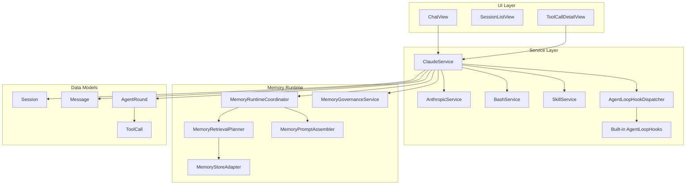

---

## 2. Agentic Loop 核心

Agentic Loop 是 Agent 执行的核心引擎，负责与 Claude API 交互、处理流式响应、管理工具调用和状态转换。

### 2.1 架构图

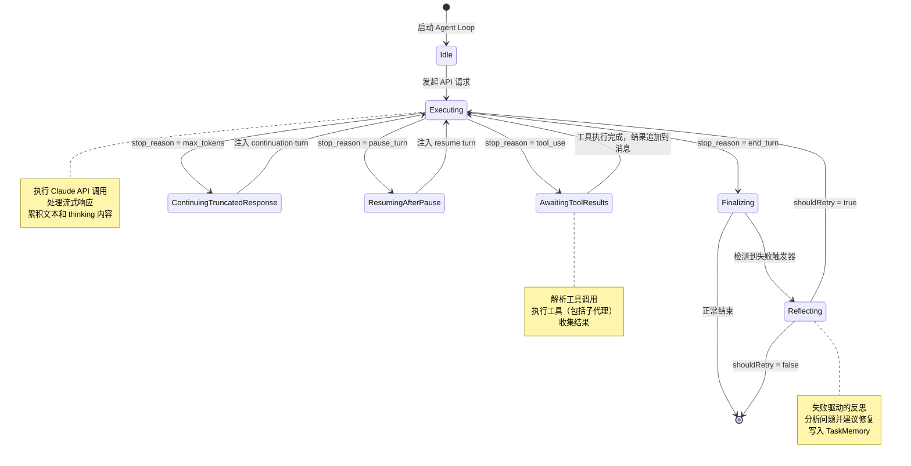

### 2.2 核心组件

#### 2.2.1 `runCoreAgentLoop`

共享的 agentic loop 实现，主代理、子代理和 workflow worker 都使用此函数。当前版本里，loop 内核负责状态推进、stream 消费、工具执行主流程，以及在关键边界调用 hook dispatcher；UI 投影、observability、bootstrap、tool audit、reflection 和 finalization policy 已迁移到内建 hooks。

```swift
func runCoreAgentLoop(
    messages: inout [MessageParameter.Message],
    service: any AnthropicService,
    modelId: String,
    tools: [MessageParameter.Tool],
    system: MessageParameter.System?,
    settings: AppSettings,
    session: Session?,
    sessionId: String,
    modelContext: ModelContext,
    maxRounds: Int,
    makeRound: (Int) -> AgentRound,    // 差异化主/子代理的 round 创建
    parentMessage: Message?,            // 主代理有值，子代理为 nil
    streamProjectionTarget: AgentLoopStreamProjectionTarget = .none,
    toolInterceptor: ((String, MessageResponse.Content.Input) async -> ToolExecutionResult?)? = nil,
    executionRequirement: ExecutionRequirement = .none,
    toolExecutionContext: ToolContext = .mainAgent
) async throws -> AgentLoopRunResult
```

**参数化设计**：

| 参数 | 主代理 | 子代理 |
|------|--------|--------|
| `makeRound` | 创建 `AgentRound`，关联到 `Message` | 创建 `AgentRound`，关联到 `ToolCall` |
| `parentMessage` | 当前 `Message` | `nil` |
| `streamProjectionTarget` | `.message(assistantMessage)`，通过 `StreamProjectionHook` 更新 UI | `.none`，不做主消息投影 |
| `toolExecutionContext` | `.mainAgent` | `.subagent` |

workflow worker 也复用同一个 loop，只是把 `streamProjectionTarget` 设为 `.workflowAction(...)`，由 hook 生成 action snippet，而不是继续依赖专用 callback。

#### 2.2.2 Hook Dispatcher 与内建 Hook 管线

当前 Agent Loop 的扩展结构已经收敛为三层：

1. `runCoreAgentLoop(...)`：只负责状态机、stream、工具执行与 hook 分发边界。
2. `AgentLoopBuiltInHookFactory`：基于本次 run 的显式依赖和共享 state 装配内建 hooks。
3. `AgentLoopHookDispatcher`：按 `order` 串行调度适用 hook，聚合 patch、decision、record 与 failure trigger。
4. 内建 hooks：封装 observability、stream projection、memory bootstrap、tool audit、failure classification、reflection handling 和 finalization guard。

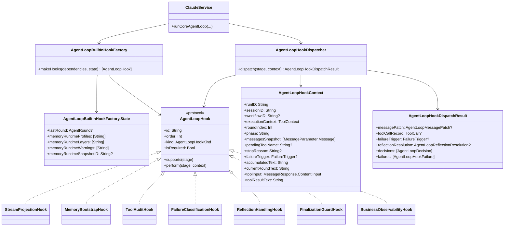

当前内建 hooks 的职责分配如下：

当前实现里，这些 hooks 不是直接在 `runCoreAgentLoop(...)` 里内联拼装，而是由 `AgentLoopBuiltInHookFactory` 基于一次运行的 dependencies + `State` 组装。`State` 用来承载此前隐藏在局部闭包捕获里的共享运行态，例如最近一轮 `AgentRound` 和 memory runtime 元数据。

| Hook | 当前职责 |
|------|----------|
| `StreamProjectionHook` | 处理 `didReceiveTextDelta`，把累计文本投影到主消息或 workflow action snippet |
| `MemoryBootstrapHook` | 在 `prepareRun` 阶段返回 unified/task/story memory 的 message patch |
| `ToolAuditHook` | 在 `willExecuteTool` / `didExecuteTool` 阶段创建和更新 `ToolCall` 记录 |
| `FailureClassificationHook` | 将 tool error、reviewer rejection、executor failed JSON 分类为 `FailureTrigger` |
| `ReflectionHandlingHook` | 在 `processReflection` 阶段执行业务反思、落盘 round 数据并返回 correction prompt |
| `FinalizationGuardHook` | 在 `decideFinalization` 阶段把 `ExecutionGuard` 决策映射为强类型 finalization decision |
| `BusinessObservabilityHook` | 把 hook stage 映射到 `AgentBusinessEvent`，统一输出到 `BusinessMonitor` |

当前 dispatcher 执行规则：

- 同一 stage 按 `order` 升序执行。
- `observer` 失败会记录到 `failures`，但不会中断 loop。
- `isRequired == true` 且非 `observer` 的 hook 失败时，dispatcher 会返回 `abortReason`。

#### 2.2.3 `AgentLoopContext` - 状态机

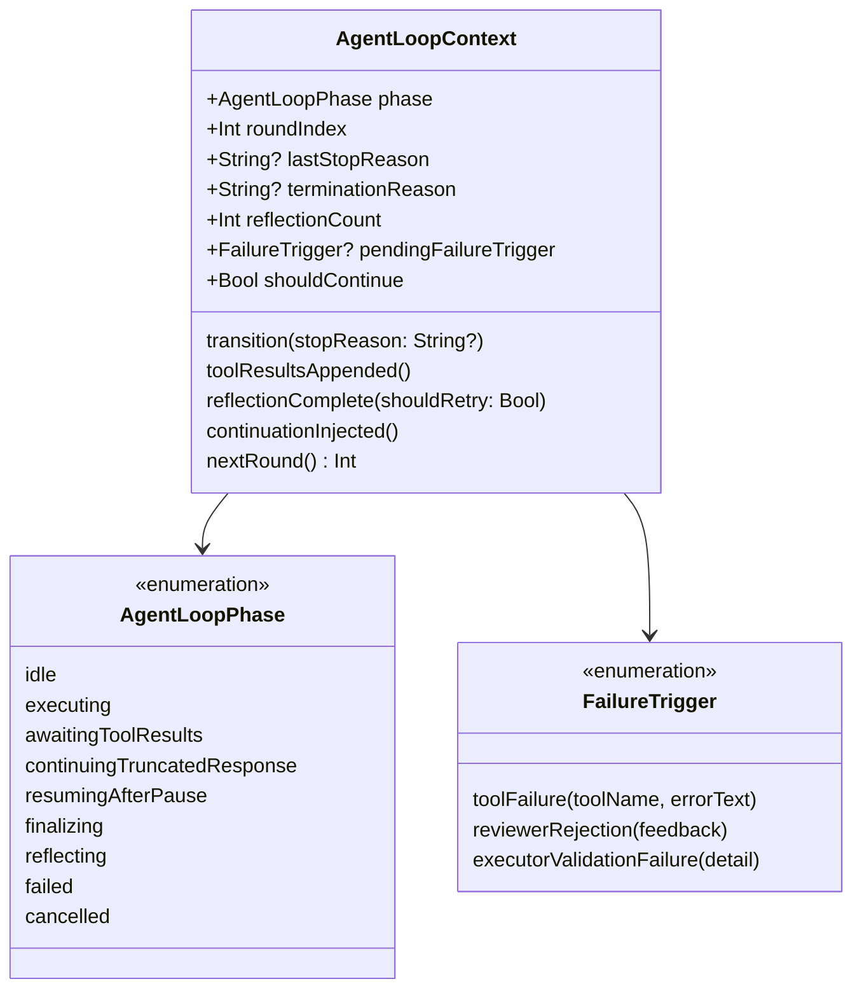

**状态转换逻辑** (`ClaudeService+AgenticLoop.swift:90-105`):

```swift
mutating func transition(stopReason: String?) {
    lastStopReason = stopReason
    switch stopReason {
    case "tool_use":    phase = .awaitingToolResults
    case "end_turn":    phase = .finalizing
    case "max_tokens":  phase = .continuingTruncatedResponse
    case "pause_turn":  phase = .resumingAfterPause
    default:            phase = .failed
    }
}
```

#### 2.2.4 `AgentRound` - 轮次持久化

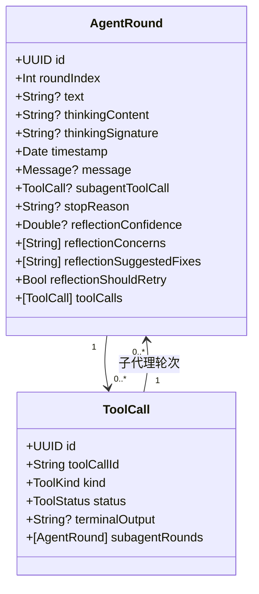

---

## 3. 工具系统

### 3.1 工具注册与构建

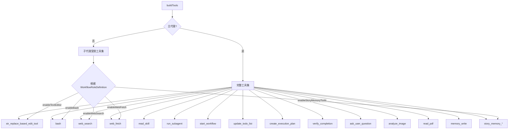

### 3.2 工具分发

```mermaid
sequenceDiagram
    participant Loop as Agentic Loop
    participant Dispatch as Tool Dispatch
    participant Executor as Tool Executor
    participant Tool as 工具实现

    Loop->>Dispatch: executeTool(name, input, settings, session, modelContext)
    Dispatch->>Dispatch: 匹配工具名称
    alt memory_write
        Dispatch->>Executor: executeGovernedMemoryWrite
        Executor->>Executor: MemoryGovernanceService.route
        alt 通过治理
            Executor->>Tool: UnifiedMemoryFileStoreAdapter / BackgroundQueue
            Tool-->>Executor: hot path / background / archive / confirmation
        else 拒绝
            Executor-->>Loop: 错误消息或待确认提示
        end
    else run_subagent
        Dispatch->>Executor: executeRunSubagentTool
        Executor->>Executor: runSubagentLoop (嵌套 Agentic Loop)
        Executor-->>Loop: AgentMessage
    else story_memory_*
        Dispatch->>Executor: executeStoryMemory*
        Executor-->>Loop: 结构化结果
    else 其他工具
        Dispatch->>Tool: executeTool
        Tool-->>Loop: ToolExecutionResult
    end
```

---

## 4. 子代理系统

### 4.1 子代理架构

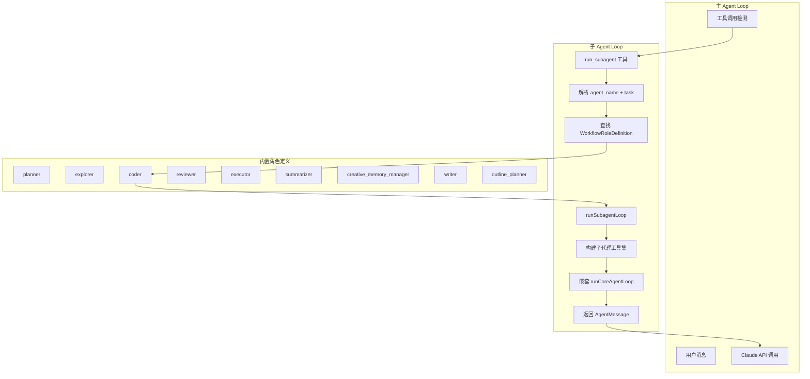

### 4.2 `WorkflowRoleDefinition` - 角色定义

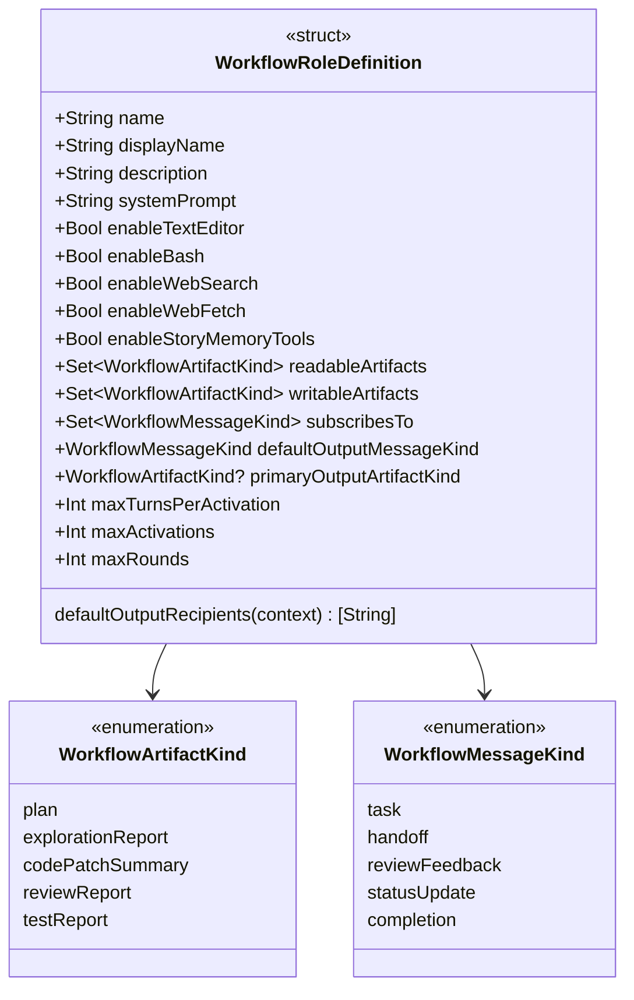

### 4.3 内置角色对比

| 角色 | 文本编辑 | Bash | 网络搜索 | 故事记忆 | 专注领域 |
|------|---------|------|----------|---------|----------|
| `planner` | ✓ (仅 view) | ✗ | ✗ | ✗ | 规划执行计划 |
| `explorer` | ✓ (仅 view) | ✗ | ✓ | ✓ | 信息搜集 |
| `coder` | ✓ | ✓ | ✗ | ✓ | 代码实现 |
| `reviewer` | ✓ (仅 view) | ✗ | ✗ | ✗ | 代码审查 |
| `executor` | ✗ | ✓ | ✗ | ✗ | 命令执行 |
| `summarizer` | ✓ (仅 view) | ✗ | ✗ | ✗ | 文档总结 |
| `creative_memory_manager` | ✗ | ✗ | ✗ | ✓ | 创作记忆管理 |
| `writer` | ✓ | ✓ | ✗ | ✗ | 文本创作 |
| `outline_planner` | ✓ (仅 view) | ✗ | ✗ | ✗ | 大纲规划 |

### 4.4 子代理执行流程

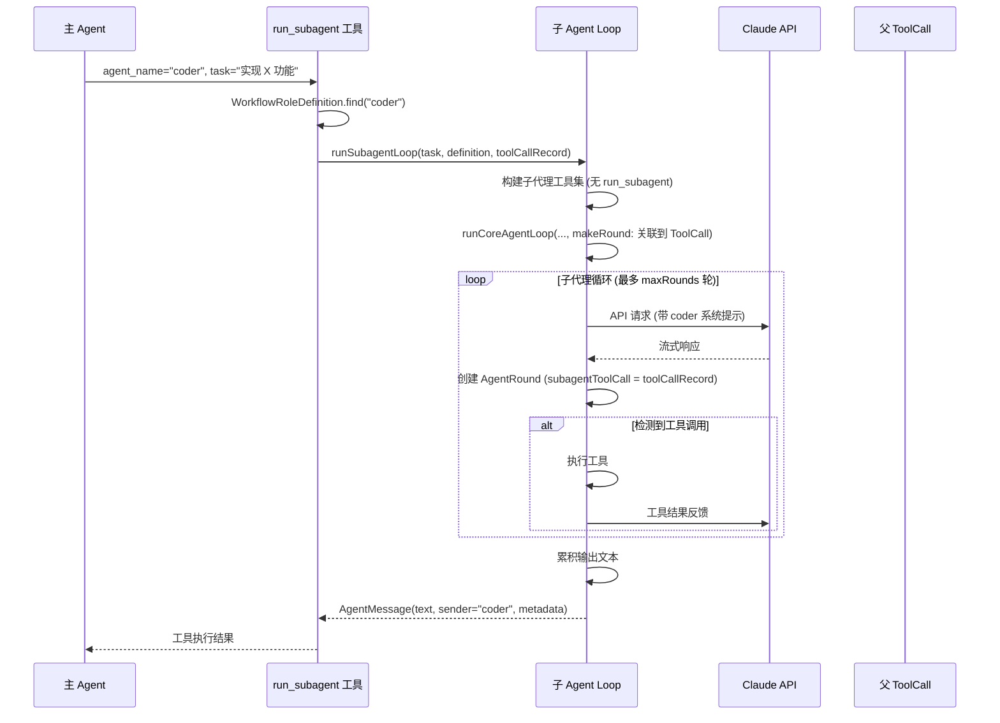

---

## 5. 记忆运行时

统一记忆运行时负责将分散的记忆源收敛到一个最小相关切片，再注入主 Agent loop。

### 5.1 记忆架构

```mermaid
flowchart TB
    subgraph Request["MemoryRuntimeRequest"]
        R1[sessionId]
        R2[threadId]
        R3[workflowRunId]
        R4[userRequest]
        R5[taskKind]
        R6[projectId]
        R7[workspaceRoot]
        R8[contextBudget]
    end

    subgraph Coordinator["MemoryRuntimeCoordinator"]
        C1[MemoryDomainProfileRegistry]
        C2[MemoryRetrievalPlanner]
        C3[TaskMemoryStoreAdapter]
        C4[StoryMemoryStoreAdapter]
        C5[UnifiedMemoryFileStoreAdapter]
        C6[MemoryPromptAssembler]
        C7[MemoryConsolidationEngine]
        C8[MemoryGovernanceService]
    end

    subgraph Response["MemoryRuntimeContext"]
        RP[profiles: [String]]
        RR[records: [MemoryRecord]]
        RW[writePolicy]
        RWN[warnings]
        RPROMPT[renderedPrompt]
    end

    Request --> Coordinator
    C1 --> C2
    C3 --> C2
    C4 --> C2
    C5 --> C2
    C2 --> C6
    C6 --> Response
    C7 --> C8
```

### 5.2 记忆层级 (MemoryLayer)

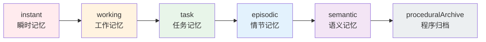

| 层级 | 持久化 | 典型内容 | 生命周期 |
|------|--------|----------|----------|
| `instant` | 否 | 单次工具调用的临时状态 | 秒级 |
| `working` | 部分 | 当前任务的中间状态 | 分钟级 |
| `task` | 是 (`TaskMemory`) | 任务级事实、失败尝试 | 会话级 |
| `episodic` | 是 (`StoryMemory`) | 故事事件、场景 | 项目级 |
| `semantic` | 是 (`StoryMemory`) | 角色、规则、风格 | 项目级 |
| `proceduralArchive` | 是 | 冷归档数据 | 长期 |

### 5.3 记忆类型 (MemoryKind)

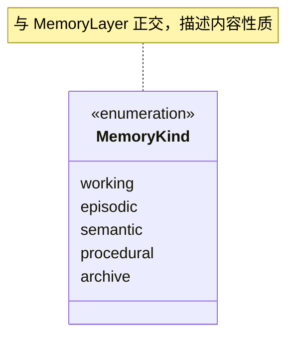

### 5.4 记忆作用域 (MemoryScope)

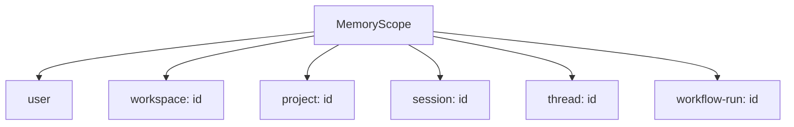

### 5.5 记忆治理

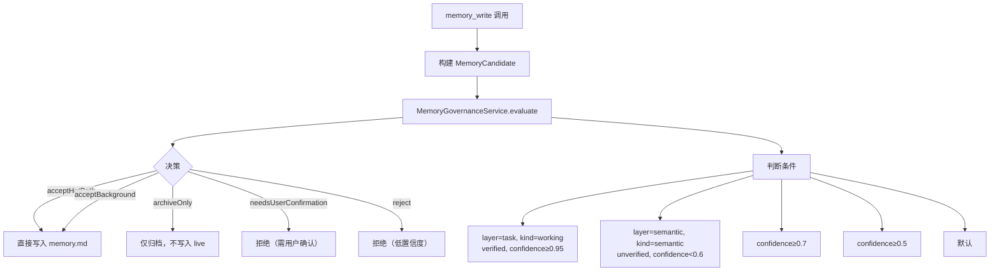

---

## 6. 故障驱动的反思机制

### 6.1 反思触发流程

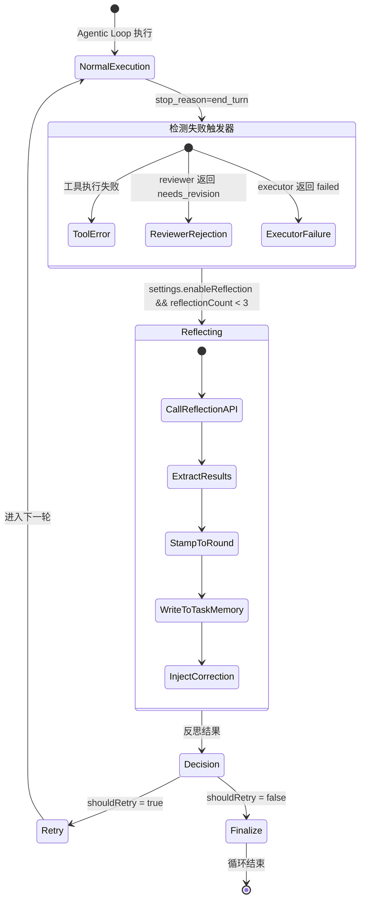

### 6.2 `FailureTrigger` 类型

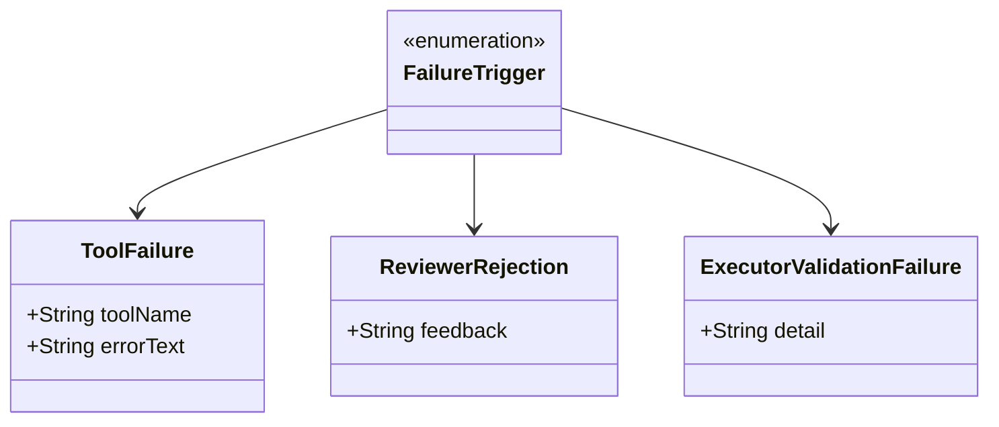

### 6.3 反思数据持久化

反思数据存储在 `AgentRound` 中：

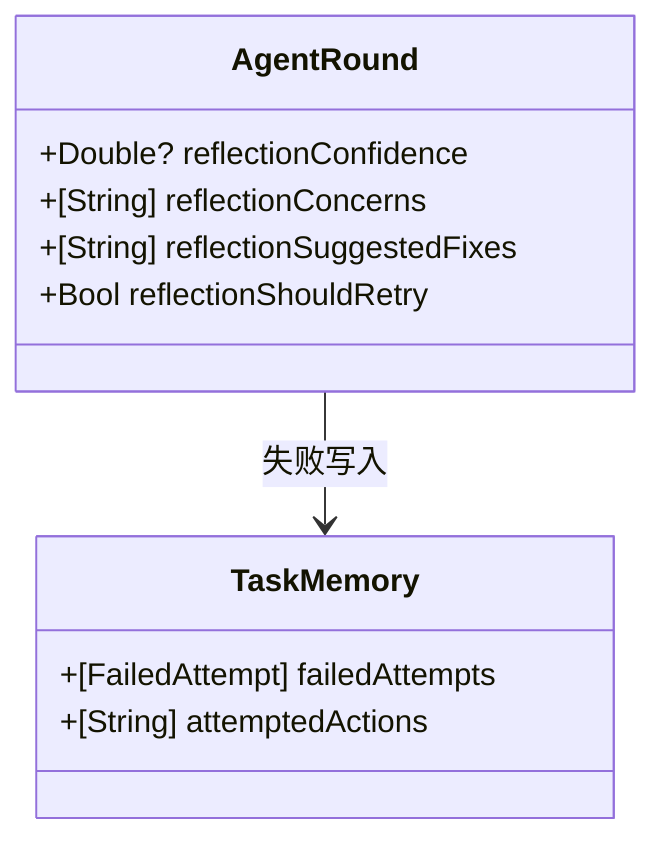

---

## 7. Extended Thinking 支持

### 7.1 Thinking 流程

```mermaid
sequenceDiagram
    participant Loop as Agentic Loop
    participant API as Claude API
    participant Round as AgentRound

    Loop->>API: MessageParameter(thinking: .init(budgetTokens: N))
    API-->>Loop: 流式响应

    loop 流式处理
        API-->>Loop: thinking_delta
        Loop->>Round: 累积 thinkingContent
        Loop->>Round: 更新 thinkingSignature (签名增量)
    end

    API-->>Loop: text_delta
    Loop->>Round: 累积 text

    Loop->>Loop: 构建下一轮消息
    Note over Loop: assistantObjects.append(.thinking(content, signature))
```

### 7.2 Thinking 模型检测

```swift
func isThinkingCapable(modelId: String) -> Bool {
    let thinkingModels = [
        "claude-3-7", "claude-3.7",
        "claude-opus-4", "claude-sonnet-4", "claude-haiku-4"
    ]
    return thinkingModels.contains { modelId.contains($0) }
}
```

---

## 8. 数据模型关系

### 8.1 SwiftData 模型图

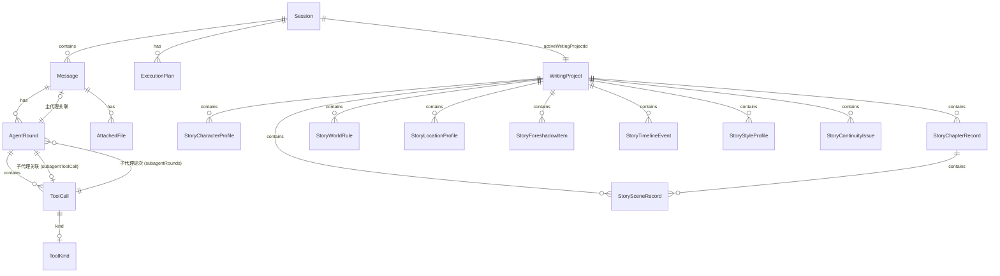

### 8.2 核心模型定义

| 模型 | 用途 | 关键字段 |
|------|------|----------|
| `Session` | 对话会话 | `sessionId`, `workingDirectory`, `activeWritingProjectId` |
| `Message` | 单条消息 | `role`, `content`, `createdAt` |
| `AgentRound` | Agent 循环轮次 | `roundIndex`, `text`, `thinkingContent`, `stopReason` |
| `ToolCall` | 工具调用记录 | `toolCallId`, `kind`, `status`, `terminalOutput` |
| `WritingProject` | 创作项目 | `title`, `synopsis` |
| `ExecutionPlan` | 执行计划 | `goal`, `steps`, `successCriteria` |

---

## 9. API 交互流程

### 9.1 完整交互序列

```mermaid
sequenceDiagram
    actor User
    participant UI as ChatView
    participant CS as ClaudeService
    participant HD as AgentLoopHookDispatcher
    participant API as Anthropic API
    participant Mem as MemoryRuntime
    participant DB as SwiftData

    User->>UI: 发送消息
    UI->>CS: sendMessage(content, session, settings)

    CS->>HD: dispatch(prepareRun)
    HD->>Mem: buildUnifiedMemoryBootstrap / fallback memory bootstrap
    Mem->>DB: 读取 TaskMemory
    Mem->>DB: 读取 StoryMemory
    Mem-->>HD: AgentLoopMessagePatch
    HD-->>CS: bootstrap patch

    CS->>CS: 应用 bootstrap message insertions

    CS->>CS: runCoreAgentLoop(messages, ...)

    loop 每轮 Agentic Loop
        CS->>HD: dispatch(willStartRound)
        CS->>API: streamMessage(params)
        API-->>CS: 流式响应

        loop 处理流式 delta
            API-->>CS: text_delta / thinking_delta
            CS->>DB: 更新 AgentRound.text / thinkingContent
            CS->>HD: dispatch(didReceiveTextDelta)
            HD->>UI: StreamProjectionHook 更新主消息 / workflow snippet
        end

        CS->>HD: dispatch(didResolveStopReason)

        alt stop_reason = tool_use
            CS->>HD: dispatch(willExecuteTool)
            HD->>DB: ToolAuditHook 创建 ToolCall 记录

            alt run_subagent
                CS->>CS: runSubagentLoop
                Note over CS: 嵌套 Agentic Loop
                CS-->>CS: AgentMessage
            else story_memory_*
                CS->>DB: 更新 WritingProject 实体
            else memory_write
                CS->>Mem: MemoryGovernanceService.evaluate
                Mem-->>CS: 决策结果
                CS->>CS: 写入 ~/.agentgui/memory.md
            else 其他工具
                CS->>CS: executeTool
            end

            CS->>HD: dispatch(didExecuteTool)
            HD->>DB: ToolAuditHook 更新 ToolCall.status / terminalOutput
            CS->>HD: dispatch(classifyFailureTrigger)
            CS->>CS: 追加工具结果到 messages
        end

        alt stop_reason = end_turn 且检测到失败
            CS->>HD: dispatch(processReflection)
            HD->>DB: ReflectionHandlingHook 更新 AgentRound 反思字段
            HD->>Mem: 写入 TaskMemory
            HD-->>CS: correction prompt patch
        end

        CS->>HD: dispatch(decideFinalization)
    end

    CS->>HD: dispatch(didFinishRun / didFailRun)
    CS-->>UI: 完成
    UI-->>User: 显示完整响应
```

---

## 10. 配置与设置

### 10.1 AppSettings 结构

```mermaid
classDiagram
    class AppSettings {
        +String apiKey
        +String model
        +String workingDirectory
        +Bool enableTextEditorTool
        +Bool enableBashTool
        +Bool enableWebSearchTool
        +Bool enableWebFetchTool
        +Bool enableStoryMemory
        +Bool enableExtendedThinking
        +Int extendedThinkingBudget
        +Bool enableReflection
        +Bool enableUnifiedMemoryRuntime
        +Bool enableMemoryGovernance
        +Int storyMemoryPromptBudget
    }
```

### 10.2 工具开关与功能对应

| 设置 | 关闭 | 开启 |
|------|------|------|
| `enableTextEditorTool` | 无文件操作 | `str_replace_based_edit_tool` |
| `enableBashTool` | 无命令执行 | `bash` |
| `enableWebSearchTool` | 无网络搜索 | `web_search` |
| `enableWebFetchTool` | 无网页抓取 | `web_fetch` |
| `enableStoryMemory` | 无故事记忆工具 | `story_memory_*` |
| `enableExtendedThinking` | 禁用思考模式 | 启用 `thinking` budget |
| `enableReflection` | 无失败反思 | 失败后自动反思 |
| `enableUnifiedMemoryRuntime` | Legacy 路径 | 统一记忆运行时 |
| `enableMemoryGovernance` | 无治理检查 | `memory_write` 治理 |

---

## 11. 性能与优化

### 11.1 流式响应处理

```mermaid
flowchart LR
    A[API Stream] --> B{delta 类型}

    B -->|text_delta| C[累积 currentRoundText]
    C --> D{达到阈值?}
    D -->|≥50 字符| E[更新 AgentRound.text]
    D -->|<50 字符| F[继续累积]
    E --> G[触发 UI 更新]

    B -->|thinking_delta| H[累积 currentRoundThinking]
    H --> I{达到阈值?}
    I -->|≥200 字符| J[更新 AgentRound.thinkingContent]
    I -->|<200 字符| K[继续累积]

    B -->|signature_delta| L[更新 thinkingSignature]

    C --> M[最终更新]
    H --> N[最终更新]
```

**节流阈值**：
- 文本更新: 50 字符
- Thinking 更新: 200 字符

### 11.2 上下文压缩

```mermaid
flowchart TD
    A[检测 contextUsageRatio] --> B{超过阈值?}

    B -->|是| C[compressIfNeeded]
    C --> D[ContextMemory.compress]
    D --> E[生成摘要]
    E --> F[移除旧轮消息]
    F --> G[插入压缩摘要]

    B -->|否| H[跳过压缩]
```

### 11.3 性能监控

```swift
private let perfLog = PerformanceMonitor.self
    A[memory_write / recordOutcome / consolidation] --> B[构建 MemoryCandidate]
    B --> C[MemoryGovernanceService.route]
// ... 执行 ...
span.end()
```
    D -->|acceptHotPath| E[直接写入 UnifiedMemoryFileStoreAdapter]
    D -->|acceptBackground| F[进入 MemoryBackgroundWriteQueue]
    D -->|archiveOnly| G[写入 archiveOnly record]
    D -->|needsUserConfirmation| H[写入 pending-confirmations.json]
    D -->|reject| I[返回拒绝]

    E --> J[RMSCognitionPanel 可见]
    F --> J
    G --> J
    H --> J

    C --> K[冲突检测]
    K -->|命中同 scope/title 规则| L[replace + supersededBy 链]

    C --> M[判断条件]
    M --> N1[layer=task, kind=working<br/>verified, confidence≥0.95]
    M --> N2[layer=semantic, kind=semantic<br/>unverified, confidence<0.6]
    M --> N3[confidence≥0.7]
    M --> N4[confidence≥0.5]
    M --> N5[默认]
        +ToolCallStatus toolCallStatus

### 5.6 已实现的写路径与巩固闭环

- `MemoryStoreAdapter` 已具备 `persist / replace / archive / touch` 写入契约，统一文件存储通过 `UnifiedMemoryFileStoreAdapter` 落在 `~/.agentgui/unified-memory/`。
- `MemoryRuntimeCoordinator.prepareContext` 现在会同时读取 TaskMemory、StoryMemory 和 unified store，并在命中 unified records 时更新 `lastAccessedAt`。
- `recordOutcome` 会把 runtime 产出的原始 `MemoryRecord` 写回 unified store；`scheduleConsolidation` 会调用 `MemoryConsolidationEngine` 生成候选，再逐条进入治理路由。
- `MemoryGovernanceService.route` 已支持四条真实路径：`hot path` 直接写入、`background` 进入后台队列、`archiveOnly` 写为归档记录、`needsUserConfirmation` 写入待确认文件。
- 冲突处理已支持最小替代链：当候选与现有 record 命中相同 scope/title 规则时，旧 record 会通过 `supersededBy` 指向新 record。

### 5.7 已实现的管理可见性

- 设置页的“长期记忆”分区已暴露统一写路径、后台巩固、待确认阈值和 TTL sweep 配置。
- 旧 `MemoryManagementPanel` 已从产品主路径移除，设置页现在打开 `RMSCognitionPanel`，主视图围绕 frontiers、反例、约束、验证债务、影响轨迹与建议动作展示当前 RMS 认知状态。
- `ToolCallDetailContentView` 已可显示 unified runtime metadata、后台巩固标记、冲突 record IDs 和待确认 candidate IDs。
- `ChatView` 在统一记忆运行时启用时会在副标题中显示治理层状态。
        +[Content] mediaContent
        +toExecutionResult() ToolExecutionResult
    }

    class ToolCallStatus {
        <<enumeration>>
        success
        failed
        cancelled
    }

    class MemoryStoreError {
        <<enumeration>>
        recordNotFound
        unsupportedOperation
        serializationFailed
    }

    ToolExecutionResult --> ToolCallStatus
```

### 12.2 失败处理流程

```mermaid
flowchart TD
    A[工具执行] --> B{成功?}

    B -->|是| C[返回成功结果]
    B -->|否| D[返回失败结果]

    D --> E{设置 LoopContext.pendingFailureTrigger}

    E --> F[下一轮 stop_reason = end_turn]
    F --> G{enableReflection?}

    G -->|是| H[进入反思阶段]
    G -->|否| I[循环结束]

    H --> J[reflectOnRound]
    J --> K{shouldRetry?}
    K -->|是| L[注入修正 prompt]
    K -->|否| I

    L --> M[继续执行]
```

---

## 13. 扩展点

### 13.1 自定义子代理角色

添加新角色到 `WorkflowRoleDefinition.all`:

```swift
static let customAgent = WorkflowRoleDefinition(
    name: "custom_agent",
    displayName: "自定义代理",
    systemPrompt: "...",
    enableTextEditor: true,
    enableBash: false,
    // ...
)
```

### 13.2 自定义工具

在 `ClaudeService+ToolDispatch.swift` 添加工具处理:

```swift
case "custom_tool":
    return .detect(executeCustomTool(input: input), toolName: name)
```

### 13.3 自定义记忆 Profile

```swift
extension MemoryDomainProfile {
    static func customProfile() -> MemoryDomainProfile {
        MemoryDomainProfile(
            id: "custom-domain",
            supportedTaskKinds: [.coding]
        )
    }
}
```

---

## 14. 安全与权限

### 14.1 工具权限

```mermaid
flowchart LR
    A[工具调用] --> B{主/子代理?}

    B -->|主代理| C[完整工具集]
    B -->|子代理| D[受限工具集]

    D --> E[根据 WorkflowRoleDefinition 过滤]
    E --> F[禁用 run_subagent]
    E --> G[禁用 ask_user_question]
    E --> H[条件性启用其他工具]
```

### 14.2 记忆写入治理

```mermaid
flowchart TD
    A[memory_write 调用] --> B{domainProfile}

    B -->|creative-writing| C{containsSpeculativeLanguage?}
    C -->|是| D[verificationStatus = .unverified]
    C -->|否| E[verificationStatus = .verified]

    B -->|user-preferences| E

    D --> F[confidence = 0.45]
    E --> G[confidence = 1.0]

    F --> H[MemoryGovernanceService.evaluate]
    G --> H

    H --> I{决策}
    I -->|低置信度| J[needsUserConfirmation / reject]
    I -->|高置信度| K[acceptHotPath / acceptBackground]
```

---

## 15. 测试策略

### 15.1 测试覆盖

```mermaid
flowchart TD
    subgraph Unit["单元测试"]
        U1[MemoryRuntimeCoordinatorTests]
        U2[MemoryRetrievalPlannerTests]
        U3[MemoryPromptAssemblerTests]
        U4[MemoryGovernanceServiceTests]
        U5[TaskMemoryStoreAdapterTests]
        U6[StoryMemoryStoreAdapterTests]
    end

    subgraph Integration["集成测试"]
        I1[MemoryRuntimeIntegrationTests]
        I2[MemoryRuntimeSettingsTests]
    end

    subgraph E2E["端到端测试"]
        E1[手动测试各工具]
        E2[手动测试子代理]
        E3[手动测试记忆系统]
    end
```

### 15.2 测试辅助方法

```swift
// 公开测试入口
func makeStoryMemoryBootstrapForTests(
    settings: AppSettings,
    sessionId: String,
    messages: [MessageParameter.Message],
    modelContext: ModelContext
) throws -> String?

func makeSubagentToolsForTests(
    modelId: String,
    definition: WorkflowRoleDefinition,
    settings: AppSettings
) -> [MessageParameter.Tool]
```

---

## 16. 未来演进

### 16.1 已完成 (Phase 1)

- ✅ 核心 Agentic Loop
- ✅ 工具系统与分发
- ✅ 子代理委派 (`run_subagent`)
- ✅ Extended Thinking 支持
- ✅ 失败驱动的反思机制
- ✅ 统一记忆运行时 (读路径)
- ✅ 记忆治理服务
- ✅ 统一写路径与文件型 unified store
- ✅ 冲突替代链、TTL sweep 与再验证队列
- ✅ Prompt budgeting / consolidation / coordinator 闭环
- ✅ 基础治理管理面板

### 16.2 待完成 (Phase 2)

- ⏳ Workflow 编排系统 (`start_workflow` 完整实现)
- ⏳ 用户确认后的 approve / reject 操作流
- ⏳ 后台巩固调度器与周期性 sweep
- ⏳ 更完整的 UI 治理面与操作按钮

### 16.3 探索中 (Phase 3)

- 🔍 多模态工具扩展
- 🔍 跨会话记忆迁移
- 🔍 分布式子代理编排

---

## 17. 参考资料

### 17.1 核心文件

| 文件 | 功能 |
|------|------|
| `ClaudeService+AgenticLoop.swift` | Agent 循环核心 |
| `ClaudeService+ToolBuilder.swift` | 工具注册与构建 |
| `ClaudeService+ToolDispatch.swift` | 工具分发 |
| `ClaudeService+Subagent.swift` | 子代理支持 |
| `MemoryRuntimeCoordinator.swift` | 记忆运行时协调器 |
| `MemoryGovernanceService.swift` | 记忆治理 |
| `AgentLoopPhase.swift` | 状态机定义 |
| `WorkflowRoleDefinition.swift` | 角色定义 |

### 17.2 相关文档

- `docs/plans/2026-03-10-human-like-memory-system-architecture.md`
- `docs/spec/2026-03-10-human-like-memory-system-requirements.md`
- `README.md`

---

*本文档由 Claude Code 自动生成，最后更新: 2026-03-10*
