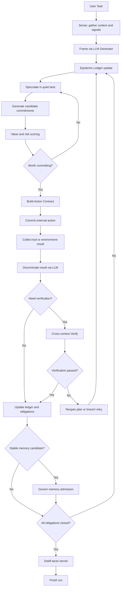
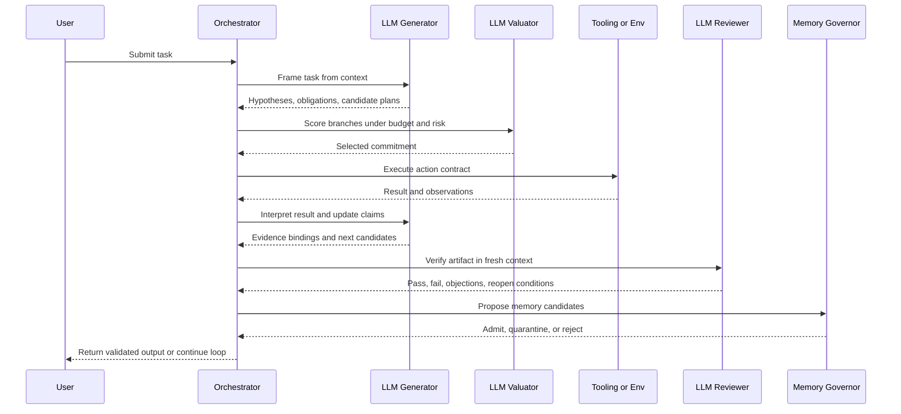

# Agent Loop 演化技术文档：从线性执行器到认知治理系统

> 状态：研究提案  
> 日期：2026-03-14

---

## 1. 执行摘要

我对当前 agent loop 的判断很直接：下一代 agent loop 不应该继续沿着“更长的 ReAct 轨迹 + 更多子代理 + 更多 hook”这条线性扩展，而应该演化成一个以认知状态为中心、以验证和记忆治理为约束、以预算感知搜索为核心的控制系统。

更具体地说，未来的 loop 不应再把“消息 transcript”当作主状态，而应把“可检验的 epistemic state”当作主状态；不应把 verifier 放在结束前做补丁式终检，而应让 verification 成为每次提交不可逆动作之前的过程控制；不应把 memory 当作 prompt 拼接的库存，而应把 memory 当作带治理规则、衰减、隔离和准入控制的长期资产；也不应默认多代理比单代理更强，而应让代理拓扑由不确定性、任务耦合度和预算动态决定。

基于这一判断，我提出一个新的 agent loop 范式：ECL，Epistemic Control Loop，认知控制环。它不是 ReAct、ToT、AutoGen、plan-execute-verify 的简单混合版，而是把 loop 拆成三条正交控制面：

1. 认知面：维护 hypotheses、evidence、obligations、risks、commitments。
2. 执行面：只负责最小必要的外部动作提交与结果回流。
3. 治理面：负责验证、记忆准入、预算调度、重开条件与停止条件。

如果 agentGui 要继续进化，我建议从“phase machine + hooks”升级到“epistemic state machine + typed acts + governed memory + cross-context verification”。这会比继续堆叠更多 loop 分支更有上限。

---

## 2. 为什么现有 agent loop 会遇到天花板

当前主流 agent loop，不论实现细节如何，通常都共享五个结构性问题。

### 2.1 transcript 驱动，而不是状态驱动

绝大多数系统把“完整对话历史”视为唯一真相源。结果是：

- 规划、反思、验证、记忆写入都混在一个上下文里。
- 旧错误会通过上下文污染影响后续判断。
- 系统很难区分“已验证事实”和“模型刚刚说过的话”。

### 2.2 单轨执行，缺少预算感知搜索

很多 loop 看起来有 reflection、retry、subagent，但本质上还是单轨 rollout。它们并没有真正表达：

- 哪些分支值得探索。
- 哪些动作是不可逆的。
- 哪些不确定性应该花更多 test-time compute。

### 2.3 verification 太晚，且常与生成上下文耦合

许多系统把 verifier 放在尾部，扮演“收尾 QA”。这会带来两个后果：

- 已经执行了很多代价高的动作后才发现路径错了。
- 生成与审查共处一个上下文，review 容易被自产生内容绑架。

### 2.4 memory 被当作 retrieval 仓库，而不是治理对象

只要 agent 能写长期记忆，就一定会引入：

- 语义漂移。
- 递归摘要失真。
- 敏感信息固化。
- 错误策略被“经验化”。

如果没有准入、衰减、隔离和版本化，memory 越强，长期风险越高。

### 2.5 multi-agent 常被误用成结构升级

多代理不是答案本身。很多系统只是把单代理的问题复制成多个角色：

- 角色分工没有 typed contract。
- disagreement 无法保留。
- 结果汇合只靠投票或自然语言总结。
- token 成本远大于结构收益。

因此，agent loop 的下一步，不应是“再加一个 reviewer/critic/verifier agent”，而应是先定义什么叫可治理的认知流。

---

## 3. 近期论文和理论给出的关键信号

下面只提炼对 loop 演化真正有结构性价值的信号，而不是罗列名词。

### 3.1 ReAct：把推理和行动交织起来是对的，但还只是执行轨迹

ReAct 证明了 reasoning 和 acting 必须交织，而不是先想完再做或只做不想。它解决的是“agent 如何边观察边更新计划”。但它仍然把 loop 建立在自然语言轨迹上，而不是显式状态上。因此它是 agent loop 的起点，不是终点。

启发：

- Thought 和 Action 必须交错。
- 观察必须反哺规划。
- 但轨迹本身不应继续充当唯一状态机。

来源：ReAct: Synergizing Reasoning and Acting in Language Models, arXiv:2210.03629。

### 3.2 Tree of Thoughts 与 LATS：搜索是必要的，但搜索对象不能只是文本分支

Tree of Thoughts 和 LATS 都在说明一件事：单路径 rollout 对复杂任务不够。ToT 让模型在“thought”层级搜索，LATS 进一步把 reasoning、acting、planning 和 value estimation 结合，并引入环境反馈与 MCTS 风格探索。

启发：

- agent 需要 branch，不只是 retry。
- branch 必须受价值函数、外部反馈、预算约束调度。
- 但未来更关键的，不是搜索多少段文本，而是搜索哪些 epistemic commitments 值得被提交。

来源：Tree of Thoughts, arXiv:2305.10601；Language Agent Tree Search, arXiv:2310.04406。

### 3.3 Reflexion：反思有效，但“写一段反思”还不够结构化

Reflexion 证明 verbal feedback 和 episodic memory 可以提升 agent 的 trial-and-error 学习效率。这条线是对的。但它的局限也很明显：反思经常仍是自由文本，容易重复、污染和漂移。

启发：

- 反思必须保留。
- 但反思应沉淀成 typed failure objects，而不是继续堆自由文本摘要。

来源：Reflexion, arXiv:2303.11366。

### 3.4 Process Supervision：验证不能只盯结果，必须盯中间步骤

Let's Verify Step by Step 的关键不是数学本身，而是证明了 process supervision 往往优于 outcome supervision。迁移到 agent loop 上，这意味着 verifier 不应只在最终 answer 上打分，而应作用于中间过程：计划是否可证、工具调用是否满足前置条件、证据是否真的支撑结论。

启发：

- verifier 应内嵌到过程。
- verification target 应是 step、claim、evidence binding，而不是仅 final answer。

来源：Let's Verify Step by Step, arXiv:2305.20050。

### 3.5 Self-Discover 与 Quiet-STaR：test-time compute 的价值在于“先形成思维结构，再开口”

Self-Discover 表明模型可以为任务自组 reasoning structure，而 Quiet-STaR 则把“先想再说”的隐式思考进一步推向 token 级别。两者共同说明，agent loop 未来不应把所有思考都外显成对话消息，而应引入 quiet reasoning lane：在不触发外部副作用的情况下进行结构选择、局部分支评估与提案形成。

启发：

- 应区分 quiet cognition 与 public action。
- 不是所有 reasoning 都应该写回 transcript。
- 计算预算应优先投向高不确定性局部，而不是平均撒在整轮生成上。

来源：Self-Discover, arXiv:2402.03620；Quiet-STaR, arXiv:2403.09629。

### 3.6 Voyager：真正有价值的长期学习不是“记住说过什么”，而是沉淀可复用技能

Voyager 的价值不在 Minecraft，而在它证明了开放式 agent 更需要 skill library、自动课程和可复用程序资产，而不是无限增长的对话历史。

启发：

- 长期记忆中最值钱的是 tactic/skill，不是原始轨迹。
- agent loop 应有从 episode 中抽取 strategy kernel 的蒸馏机制。

来源：Voyager, arXiv:2305.16291。

### 3.7 2026 新信号一：Cross-Context Review 说明“上下文隔离”本身就是增益

Cross-Context Review 的结果很重要。它表明 review 放在新 session 中，优于同上下文自审，且优势来自上下文隔离本身，而不是简单重复检查。

启发：

- verifier/reviewer 不应共享生产上下文。
- 生产态和审查态要物理隔离。
- “fresh context reviewer” 应成为 loop 原语，而不是外围技巧。

来源：Cross-Context Review, arXiv:2603.12123。

### 3.8 2026 新信号二：Try-Check-Retry 把长上下文工具调用问题重新表述为分治

Try, Check and Retry 的核心不是某个 benchmark 提升，而是它把 noisy tool space 下的调用问题重写为 divide-and-conquer + self-reflection。这个思路对 coding agent 尤其重要，因为工具选择、参数绑定、结果判断都可以局部化，而不是一次性在巨长上下文里完成。

启发：

- tool use 应先局部 framing，再执行，再局部检查。
- 对工具调用的验证应贴近调用点，而不是放到整轮末尾。

来源：Try, Check and Retry, arXiv:2603.11495。

### 3.9 2026 新信号三：typed epistemic acts 比“辩论”更适合高代价决策

From Debate to Deliberation 的关键结论不是“多代理更强”，而是“结构化 deliberation 在后果严重、观点冲突大的任务上更有价值”。它引入 typed epistemic acts、minority report、residual objections、reopen conditions，这些都非常适合 agent loop 的高风险节点。

启发：

- 关键决策不应只有 approve/reject。
- loop 需要 typed acts：propose、challenge、support、object、defer、commit、reopen。
- disagreement 需要持久化，而不是被 summary 吞掉。

来源：From Debate to Deliberation, arXiv:2603.11781。

### 3.10 2026 新信号四：memory governance 将成为 agent 成熟度分水岭

Governing Evolving Memory 这类工作在提醒一个被严重低估的问题：当 memory 从“检索辅助”变成“自我演化系统”，其核心难题不再是召回率，而是治理。包括一致性验证、时间衰减、动态访问控制、敏感信息泄漏和摘要漂移。

启发：

- 记忆写入必须和执行分离。
- consolidation 前必须有稳定性检查。
- memory 需要 quarantine 区、candidate 区、stable 区。

来源：Governing Evolving Memory in LLM Agents, arXiv:2603.11768。

### 3.11 2026 新信号五：orchestration-level verification 是更高一层的控制信号

Verified Multi-Agent Orchestration 强调 verifier 不只是看子任务结果，而是作为 orchestration-level signal 驱动 DAG 重规划和停止条件。

启发：

- verification 不是 leaf utility，而是 scheduler utility。
- 计划重开、分支裁剪、预算续投应由 verifier 信号驱动。

来源：Verified Multi-Agent Orchestration, arXiv:2603.11445。

---

## 4. 一个新的方向：ECL，Epistemic Control Loop

我建议下一代 agent loop 采用 ECL，而不是继续修补 transcript loop。

ECL 的核心思想是：agent 的主状态不是“目前对话写到了哪里”，而是“目前已知什么、未知什么、哪些说法已被验证、哪些动作允许提交、哪些记忆允许固化”。

### 4.1 ECL 的核心状态对象

ECL 维护一个显式的 `Epistemic Ledger`，至少包含以下对象：

| 对象 | 含义 |
|------|------|
| `Hypothesis` | 待验证的任务解释、计划分支、诊断猜测 |
| `Evidence` | 来自工具、环境、用户、文件、测试的证据 |
| `Claim` | agent 想对外陈述的断言 |
| `Binding` | `Claim <- Evidence` 的支撑关系 |
| `Obligation` | 必须在结束前满足的验证义务 |
| `Risk` | 当前路径的失败风险、代价风险、安全风险 |
| `Commitment` | 已决定提交的动作或结论 |
| `ResidualObjection` | 尚未解决但被保留的异议 |
| `ReopenCondition` | 什么情况下应重开规划或重审 |
| `MemoryCandidate` | 准备进入长期记忆但尚未治理通过的条目 |

这个 Ledger 才是 loop 的一等公民；消息 transcript 只是其中一种投影。

### 4.2 ECL 的八阶段状态机

我建议把 loop 组织为以下八个阶段：

1. `Sense`
   读取用户输入、环境反馈、外部观察，形成初始 evidence。
2. `Frame`
   将任务重写为 hypothesis、obligation、risk budget，而不是直接产出计划文本。
3. `Speculate`
   在 quiet lane 中做预算感知搜索，产生多个 candidate commitments，但不触发外部副作用。
4. `Select`
   用 verifier/value model/risk policy 选择一个最值得提交的局部动作或子计划。
5. `Commit`
   执行最小必要动作，如调用工具、编辑文件、发起子代理、向用户回复。
6. `Verify`
   在新上下文中验证 claim、tool result、plan completeness、exit readiness。
7. `Consolidate`
   只有通过治理的 candidate 才进入长期记忆或技能库。
8. `Distill`
   抽取 tactic kernel、error pattern、reopen condition，用于未来 episode。

这和常见 plan-execute-reflect 的本质区别在于：外部动作提交前必须经过 `Speculate -> Select`，而长期记忆固化前必须经过 `Verify -> Consolidate`。

### 4.3 三条控制面，而不是一个大循环

#### A. 认知控制面

负责 hypothesis formation、evidence binding、uncertainty estimation、branch generation。它主要运行在 quiet lane，不应产生副作用。

#### B. 执行控制面

负责最小必要的 actuation。每个工具调用、文件编辑、子代理启动，都必须被包装成带 preconditions 和 expected postconditions 的 `Action Contract`。

#### C. 治理控制面

负责：

- cross-context verification
- memory admission
- risk budget
- stop / reopen policy
- minority report persistence

这意味着 verifier、memory governor、budget allocator 不再是辅助模块，而是 loop 的共同控制器。

### 4.4 大模型在 ECL 里到底扮演什么角色

你指出的缺口是对的。上面的写法如果停在这里，确实更像传统软件控制架构，还没有说清楚大模型不是“被框起来调用的组件”，而是 ECL 中的核心计算介质。

我对这个问题的判断是：大模型不应该在 ECL 中只扮演一个统一的“决策器”，而应该被拆成四种不同的认知算子。也就是说，ECL 不是 “软件状态机 + 一个 LLM API”，而是 “软件调度边界 + 多种 LLM 计算模式” 的联合系统。

#### 角色 A：生成算子 `Generator`

负责提出候选 plan、claim、tool binding、patch 草案、用户回复草案。它的任务不是给出最终答案，而是最大化候选空间的覆盖率。

在这个角色里，大模型的优势是：

- 把模糊任务压缩成可操作 proposal。
- 在不完整信息下提出多个 plausible branch。
- 生成可供后续审查的草案对象。

#### 角色 B：判别算子 `Discriminator`

负责判断某个候选 proposal 是否满足目标、约束和当前证据。这里的大模型不是继续“生成更多文本”，而是作为语义判别器：

- 这个 claim 是否被证据真正支撑。
- 这个 tool call 是否满足前置条件。
- 这个 patch 是否真的响应了 review artifact。
- 当前回答是否覆盖了 obligations。

这对应 process supervision、cross-context review 和 orchestration-level verification 的那一侧。

#### 角色 C：压缩算子 `Compressor`

负责把长轨迹压缩为结构化认知对象，而不是普通摘要。它输出的不是“这轮做了什么”，而是：

- 哪些 hypothesis 被证伪。
- 哪些 evidence 值得保留。
- 哪些 tactic kernel 具有复用价值。
- 哪些 reopen condition 应写入长期策略。

这个角色是 memory governance 的核心。如果没有这个角色，memory 最后只会退化为 transcript summary store。

#### 角色 D：价值算子 `Valuator`

负责在有限预算下分配 test-time compute。它不一定是独立模型，也可以是同一模型在不同 prompt contract 下的输出，但语义上它必须独立存在。它要回答：

- 这个节点是否值得继续 branch。
- 这个任务是否值得启动 cross-context verifier。
- 当前 uncertainty 是否足以触发 multi-agent deliberation。
- 该不该提前停止，而不是继续高成本自旋。

因此，ECL 的关键不是“用了大模型”，而是把大模型从单一聊天引擎拆成了四类认知算子：生成、判别、压缩、估值。

### 4.5 ECL 的 LLM-native 理论核心

如果把 ECL 写成一句更贴近大模型本体的理论表述，我会这么定义：

> ECL 是一种将大模型视为可重配置认知算子集合的运行时框架；系统通过显式状态、验证约束和预算调度，将同一基础模型在 proposal、critique、compression、valuation 四种模式之间切换，从而把原本隐含在 token 生成里的认知过程外化为可治理的 agent control loop。

这和传统软件设计最大的不同在于：

1. 大模型不是“填补规则空白”的启发式模块，而是主计算资源。
2. 软件层的职责不是替代模型思考，而是约束模型何时以何种模式思考。
3. loop 的质量上限来自 test-time cognition orchestration，而不是状态机分支本身。

换句话说，软件负责定边界，LLM 负责做高维语义计算，二者不是主从关系，而是分工关系。

### 4.6 一次完整运行时流程

下面给出一次 coding agent 任务的具体运行路径。这个流程里，大模型不是只在开头和结尾说两次话，而是以不同算子身份持续参与。

#### 运行时主流程

1. 用户任务进入系统后，`Sense` 阶段先收集对话输入、仓库上下文、现有 artifact 和环境信号。
2. LLM 以 `Generator` 角色执行 `Frame`，产出任务解释、候选目标、初始 obligations 和风险假设。
3. LLM 进入 quiet lane，以 `Generator + Valuator` 组合生成多个局部 candidate commitments，例如：先读文件、先跑测试、先做 verifier check、先问用户澄清。
4. `Select` 阶段由 `Valuator` 比较候选的期望收益、失败风险和 token/tool 成本，挑出最值得提交的下一步动作。
5. `Commit` 阶段执行最小外部动作，比如读取文件、调用工具、运行测试、修改代码。
6. 动作结果回流后，LLM 以 `Discriminator` 角色判断：结果是否满足前置假设，是否形成新 evidence，是否触发 failure trigger。
7. 若动作属于高风险提交，例如代码修改、最终答案生成、长期记忆写入，则进入 fresh-context `Verify`。此时 review 与 production 上下文隔离。
8. 验证通过后，`Compressor` 从本轮轨迹中提取 claim/evidence binding、可复用 tactic kernel 与 memory candidates。
9. `Consolidate` 只把通过治理的 candidates 升级为 stable memory 或 reusable skill。
10. 所有 obligations 关闭、reopen condition 未触发且 budget policy 允许时，loop 才结束。

#### 为什么这是 LLM-native 而不是传统 workflow

因为在这个过程中，真正困难的部分都不是 if/else 能做的：

- task framing 依赖语义重写能力。
- candidate generation 依赖开放式 proposal 能力。
- claim-evidence binding 依赖细粒度语义判别。
- tactic distillation 依赖对长轨迹的抽象压缩。
- value estimation 依赖对不确定性、成本和收益的语言化比较。

软件层只负责把这些计算放在正确的边界上发生。

### 4.7 具体运行流程图

### 4.8 运行时交互时序图

---

## 5. ECL 的几个原创设计点

下面这些点是我认为值得做、且不应照搬现有系统的部分。

### 5.1 从“反思文本”升级到“typed epistemic acts”

不要再让 agent 只输出“我反思到刚才可能遗漏了测试”。这类自由文本太弱。应把中间认知动作类型化，例如：

- `propose(plan_fragment)`
- `challenge(claim_id, reason)`
- `support(claim_id, evidence_ids)`
- `defer(obligation_id, trigger)`
- `commit(action_contract)`
- `object(commitment_id, risk)`
- `reopen(scope, reason)`
- `close(obligation_id)`

这样，loop 才能真正基于结构对象调度，而不是基于 prompt 文本猜测意图。

### 5.2 引入 quiet planning lane，避免把所有思考外显成消息

未来高质量 agent 不应该把全部思维都写进会话。quiet lane 的目标是：

- 做局部分支搜索。
- 比较备选工具方案。
- 生成 shadow plan。
- 评估是否值得调用昂贵 verifier。

只有被选中的 commitment 才进入公共轨迹。这样可以显著减少上下文污染，并让 test-time compute 更集中地服务高风险节点。

### 5.3 引入 `Action Contract`，把工具调用从“文本命令”提升为“可验证承诺”

每个外部动作都不应只是 `tool_name + input`，而应包含：

- 目标：为什么做。
- 前置条件：缺什么证据不能做。
- 后置条件：什么结果算完成。
- 可逆性：失败是否可以回滚。
- 验证器：由谁检查成功。
- 记忆影响：该动作结果是否允许写入长期记忆。

这会让 tool call 从“模型试一下”变成“系统可治理提交”。

### 5.4 cross-context verification 成为原语，而不是 reviewer 角色

与其定义 reviewer agent，不如定义一种 runtime primitive：

- 生成态上下文：拥有完整生产历史。
- 审查态上下文：只拿 artifact、目标、约束、必要证据，不拿生成轨迹。

这比“让另一个 agent 看一眼”更强，因为它直接把上下文隔离写进系统语义。

### 5.5 记忆采用三段式准入：quarantine -> candidate -> stable

任何 memory write 都应该先进入 `quarantine`。只有当它：

- 被后续 episode 复用过。
- 未与高置信事实冲突。
- 通过敏感信息审查。
- 没有摘要漂移迹象。

才可以升级为 `stable memory`。

这比当前“抽取后直接可用”的思路稳得多。

### 5.6 技能蒸馏目标从“总结经验”变成“提取 tactic kernel”

长期学习不应只存反思摘要，而应提取最小可复用的策略核，例如：

- 遇到 UI regression 时先查可见性锚点，再做截图。
- Bash 任务失败时先区分 parse error / permission / execution / observation drift。
- 文件编辑类任务优先产出 patch，再跑 targeted verification。

这种 kernel 比整段失败轨迹更稳定，也更适合迁移。

### 5.7 multi-agent 只在两个条件下启用

我不建议默认多代理。只有在以下两类条件满足时才启用：

1. 视角冲突明显：需要保留异议、少数报告、重开条件。
2. 子问题图可并行：DAG 拆解清晰，且 verifier 能作为调度信号。

否则，优先使用单代理 + quiet branch search，通常更便宜也更稳。

---

## 6. 与现有范式的差异

### 6.1 它不是 ReAct 2.0

ReAct 关注 thought-action-observation 的交替；ECL 关注 claim-evidence-obligation-commitment 的治理。前者是行为轨迹，后者是认知控制。

### 6.2 它不是 Tree Search 的包装层

ToT/LATS 主要搜索 thought branches；ECL 搜索的是“哪些 epistemic commitments 值得被提交”，搜索对象不同。

### 6.3 它不是简单的 Plan-Execute-Verify-Replan

这类框架通常仍以子任务图和结果验收为中心。ECL 更强调：

- verification 要贯穿过程。
- memory consolidation 要单独治理。
- public transcript 与 quiet cognition 要分离。

### 6.4 它不是 AutoGen 式角色堆叠

ECL 不把多代理当默认架构，而把它看作一种高成本 deliberation 策略，只有在任务的 epistemic conflict 值得支付额外 token 时才启动。

---

## 7. 对 agentGui 的具体落地方向

如果把这个提案映射回 agentGui，我建议分四期落地。

### P0：把 transcript loop 升级为 epistemic loop 的骨架

目标：先让系统拥有显式的认知状态，而不是继续把状态散在消息与 hook metadata 中。

建议新增：

- `EpistemicLedger`
- `Claim / Evidence / Obligation / Commitment / ResidualObjection`
- `TypedEpistemicAct`
- `ActionContract`

当前的 `phase`, `failureTrigger`, `verification`, `epistemicState` 可以成为迁移入口，但不应继续停留在 loosely typed metadata 层。

### P1：把 verifier 从阶段末端提升为过程控制器

目标：把 verification 从一次尾部动作变成调度信号。

建议：

- 每个高风险工具调用都绑定局部 verifier。
- 增加 cross-context review runtime。
- finalization 不再只看“有没有 answer”，而看 obligations 是否全部关闭。

### P2：引入 quiet branch search 与预算调度

目标：让系统知道什么时候该思考，什么时候该执行，什么时候不值得继续花算力。

建议：

- 增加 `SearchBudget` 与 `RiskBudget`。
- 对高不确定性节点启用局部分支搜索。
- 对低风险 routine 节点保持单轨执行。

### P3：记忆治理与技能蒸馏

目标：把长期学习从“可检索摘要”升级成“受治理的能力资产”。

建议：

- 增加 memory quarantine/candidate/stable 三层。
- 写入前执行 drift/privacy/consistency checks。
- 从成功与失败 episode 中蒸馏 tactic kernel，而不是继续堆长摘要。

---

## 8. 建议的评估指标

如果 agent loop 要往 ECL 演进，评估也必须升级。不能只看 task success rate。

我建议至少跟踪以下指标：

### 8.1 认知质量指标

- `claim_support_ratio`：对外 claim 中有证据绑定的比例。
- `obligation_closure_rate`：结束时被关闭的 obligations 比例。
- `reopen_precision`：系统触发重开的准确性。

### 8.2 执行质量指标

- `irreversible_action_error_rate`：不可逆动作后发现错误的比例。
- `tool_retry_locality`：工具失败后是否能在局部修复，而不是整轮重跑。
- `verification_lag`：错误从产生到被 verifier 捕获的平均轮数。

### 8.3 记忆质量指标

- `memory_promotion_precision`：进入 stable memory 的条目长期仍然有效的比例。
- `semantic_drift_rate`：多轮摘要后核心事实偏移率。
- `skill_reuse_yield`：策略核被复用后带来的成功率或成本提升。

### 8.4 成本指标

- `token_per_closed_obligation`
- `branch_cost_per_saved_failure`
- `review_cost_per_defect_caught`

---

## 9. 风险与边界

这个方向也有代价，需要提前承认。

### 9.1 结构更强，系统更复杂

typed epistemic acts、Action Contract、memory governance 都会增加工程复杂度。没有 observability 的话，系统会比现在更难调。

### 9.2 quiet lane 可能引入不可见的错误

如果 quiet reasoning 完全不可观察，调试会很困难。需要设计审计级摘要，而不是暴露全部内部思维。

### 9.3 verification 成本会显著上升

cross-context review、局部 verifier、memory admission checks 都要花 token 和时间。必须由预算调度器控制何时值得做。

### 9.4 多代理 deliberation 只适合高后果决策

typed deliberation 很贵，不应默认开启。否则很容易出现“结构很漂亮，但整体吞吐下降”的问题。

---

## 10. 最终结论

我对 agent loop 的核心判断是：

下一代 agent loop 的竞争力，不在于谁把 ReAct、subagent、tool use、reflection 拼得更多，而在于谁先把 agent 从“会说会调工具的序列生成器”升级成“有认知状态、有治理边界、有预算意识的控制系统”。

因此，真正值得做的演化不是：

- 再加一个 reviewer agent。
- 再加一个 memory layer。
- 再加一个 retry hook。

而是：

1. 把 transcript 从主状态降级为投影。
2. 把 epistemic ledger 升级为主状态。
3. 把 verification 从终检升级为过程控制。
4. 把 memory 从检索仓库升级为受治理资产。
5. 把 multi-agent 从默认拓扑降级为高价值 deliberation 策略。

如果只能用一句话概括，我会这么说：

未来的 agent loop 不应是一个“会不断继续说话的循环”，而应是一个“只在认知上准备好时才提交动作、只在治理上通过时才沉淀记忆”的控制系统。

---

## 11. 参考资料

以下材料用于支撑本文的研究判断与设计提案：

1. ReAct: Synergizing Reasoning and Acting in Language Models. arXiv:2210.03629.
2. Tree of Thoughts: Deliberate Problem Solving with Large Language Models. arXiv:2305.10601.
3. Reflexion: Language Agents with Verbal Reinforcement Learning. arXiv:2303.11366.
4. Let's Verify Step by Step. arXiv:2305.20050.
5. Voyager: An Open-Ended Embodied Agent with Large Language Models. arXiv:2305.16291.
6. Language Agent Tree Search Unifies Reasoning Acting and Planning in Language Models. arXiv:2310.04406.
7. A Survey on Large Language Model based Autonomous Agents. arXiv:2308.11432.
8. AutoGen: Enabling Next-Gen LLM Applications via Multi-Agent Conversation. arXiv:2308.08155.
9. Self-Discover: Large Language Models Self-Compose Reasoning Structures. arXiv:2402.03620.
10. Quiet-STaR: Language Models Can Teach Themselves to Think Before Speaking. arXiv:2403.09629.
11. Lilian Weng, LLM Powered Autonomous Agents, 2023.
12. Cross-Context Review: Improving LLM Output Quality by Separating Production and Review Sessions. arXiv:2603.12123.
13. Try, Check and Retry: A Divide-and-Conquer Framework for Boosting Long-context Tool-Calling Performance of LLMs. arXiv:2603.11495.
14. One Supervisor, Many Modalities: Adaptive Tool Orchestration for Autonomous Queries. arXiv:2603.11545.
15. Governing Evolving Memory in LLM Agents: Risks, Mechanisms, and the Stability and Safety Governed Memory Framework. arXiv:2603.11768.
16. Verified Multi-Agent Orchestration: A Plan-Execute-Verify-Replan Framework for Complex Query Resolution. arXiv:2603.11445.
17. From Debate to Deliberation: Structured Collective Reasoning with Typed Epistemic Acts. arXiv:2603.11781.