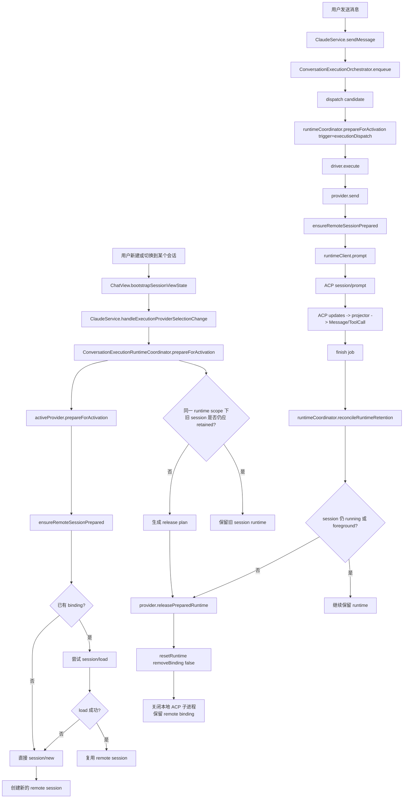
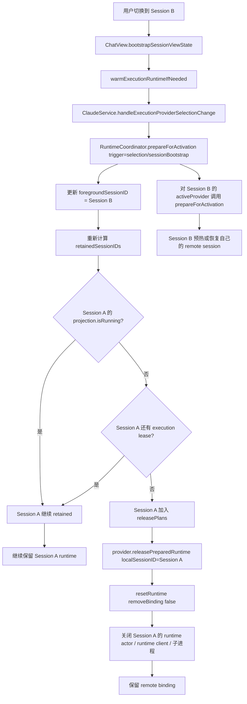
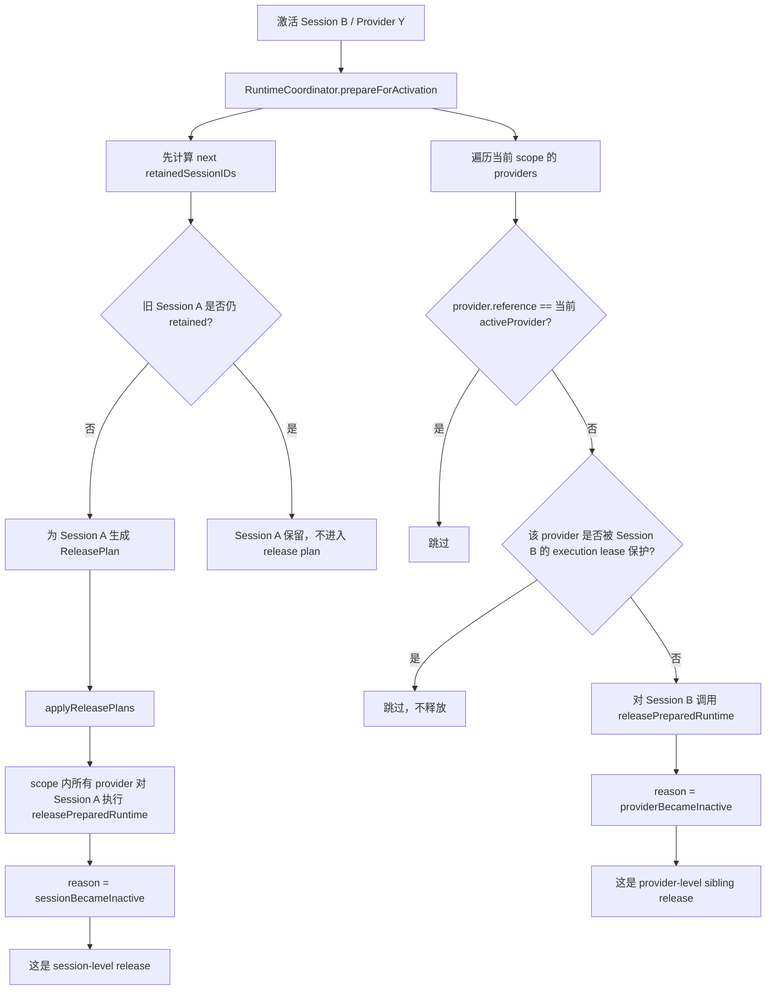
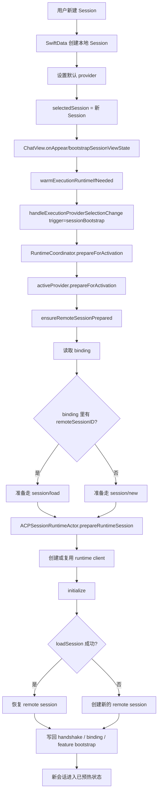
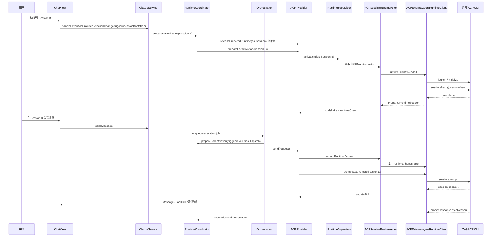

# 2026-03-28 ACP Runtime Session Lifecycle

日期：2026-03-28

## 1. 文档目标

本文档回答三个具体问题：

1. 当前 ACP runtime 正在运行时，用户切换到别的会话，系统会如何处理已有 runtime。
2. 用户新建一个会话后，到真正发送第一条消息之前，ACP runtime 会经历哪些阶段。
3. 用户发送一条消息时，ACP runtime、session binding、远端 ACP session、UI 投影分别如何联动。

本文档基于当前仓库实现，不讨论未来重构方案，也不假设系统具备应用级后台保活能力。

## 2. 结论先行

当前实现里，ACP runtime 的生命周期可以概括成一句话：

> agentGui 以本地 session 为主键管理 ACP runtime，以 provider scope 为单位做保留与回收，以 remote session binding 作为热重连和恢复的桥梁。

更具体地说：

1. 切换会话时，不会无条件关闭旧 ACP runtime。
2. 是否释放旧 runtime，取决于该 session 是否仍被 runtime coordinator 标记为 retained。
3. retained 的判断并不只看前台会话，还会看该 session 是否仍有正在运行的 job。
4. 新建本地会话时，通常只会创建 SwiftData 里的 `Session`，并不会立即建立远端 ACP session。
5. 真正的 ACP runtime 启动与 `initialize -> session/load 或 session/new -> prompt`，发生在 `prepareForActivation(...)` 预热或实际 `send(...)` 时。
6. `releasePreparedRuntime(...)` 是非破坏性释放：它会关闭本地 runtime 进程，但保留 remote session binding，供后续重新 attach。

## 3. 核心对象与职责

理解流程前，先把对象边界说清楚。

### 3.1 UI / 服务入口层

1. `ChatView`
   负责会话页面初始化、session bootstrap 预热，以及用户发送消息。
2. `ClaudeService`
   持有全局 `executionRuntimeCoordinator`、`executionProjectionStore`、`executionOrchestrator`。
3. `ConversationExecutionOrchestrator`
   负责 job 入队、调度、dispatch、finish、恢复 pending jobs。

### 3.2 Runtime 协调层

1. `ConversationExecutionRuntimeCoordinator`
   负责不同 session 在同一 runtime scope 下的前台 ownership、retention、release 计划。
2. `ConversationExecutionProviderRegistry`
   根据 provider reference 找到对应 provider。

### 3.3 ACP provider 层

1. `ACPExternalExecutionProviderBase`
   external ACP provider 的共享基类，负责：
   - 解析配置
   - 准备或恢复 remote session
   - 发送 prompt
   - 将 ACP update 投影到本地消息 / tool call / feature store
2. `ACPProviderRuntimeSupervisor`
   以 `(providerReference, localSessionID)` 为 key 找到或创建 `ACPSessionRuntimeActor`。

### 3.4 Session runtime 层

1. `ACPSessionRuntimeActor`
   某个本地 session 对应的 runtime 控制平面，持有：
   - `runtimeClient`
   - `runtimeWorkingDirectory`
   - `activationID`
   - `lastHandshake`
2. `ACPExternalAgentRuntimeClient`
   某个 ACP 子进程的协议客户端，负责：
   - 启动 ACP 进程
   - `initialize`
   - `session/load`
   - `session/new`
   - `session/prompt`

### 3.5 持久化与恢复层

1. `ACPExternalSessionBindingStore`
   保存本地 session 与 remote session 的绑定关系。
2. `ExecutionProjectionStore`
   保存各 session 的执行投影，用于判断 `isRunning`、`presentationState`、`activeProviderReference`。

## 4. 总览流程图

下面这张图把“新建会话、切换会话、发送消息、释放 runtime”的主要关系放在一张图里。



## 5. 场景一：当前 ACP runtime 正在运行时切换会话

这部分回答你最关心的问题：已有 runtime 正在运行，这时用户切到另一个 session，系统具体怎么处理。

### 5.1 触发入口

切换到某个会话页面后，`ChatView.bootstrapSessionViewState()` 会调用 `warmExecutionRuntimeIfNeeded()`，随后进入：

1. `ClaudeService.handleExecutionProviderSelectionChange(...)`
2. `ConversationExecutionRuntimeCoordinator.prepareForActivation(...)`

这里的 trigger 通常是：

1. `selection`
2. `sessionBootstrap`

这两个 trigger 都会更新某个 runtime scope 的 `foregroundSessionID`。

### 5.2 RuntimeCoordinator 做什么

`ConversationExecutionRuntimeCoordinator.prepareForActivation(...)` 的职责不是“直接启动 ACP”，而是先计算一次 scope 级别的状态迁移：

1. 当前哪个 session 成为这个 scope 的 foreground session。
2. 哪些 session 需要 retained。
3. 哪些旧 session 不再 retained，需要 release。
4. 在同一个 runtime scope 下，哪些 sibling provider 需要被释放。

关键点在 retained 规则：

1. foreground session 会 retained。
2. 本次正在激活的 session 会 retained。
3. 通过 `executionDispatch` 获得执行 lease 的 session 会 retained。
4. 即使 session 已不在 foreground，只要 `ExecutionProjectionStore` 里仍是 `isRunning == true`，也会继续 retained。

这意味着：

1. 切换会话不等于立即关闭旧 ACP runtime。
2. 如果旧会话还有正在执行的 ACP job，它通常会继续保留。
3. 只有当旧会话既不是 foreground，又不再 running，也没有 execution lease 时，才会被释放。

### 5.2.1 old session 是否 retained 的精确逻辑

上面是概念版规则。按 `ConversationExecutionRuntimeCoordinator` 当前实现，old session 是否 retained，实际上是下面这组条件合成出来的。

首先，coordinator 会为某个 runtime scope 生成新的 `retainedSessionIDs`。这个集合来自四部分：

1. `foregroundSessionID`
   只要某个 session 是该 scope 当前 foreground session，它就一定进入 retained 集合。
2. `activatingSessionID`
   当前正在激活的 session 会被直接插入 retained 集合。
3. `executionLeaseProviderReferencesBySessionID.keys`
   只要某个 session 在该 scope 下拿到过 execution dispatch lease，它也会先进入 retained 集合。
4. `currentState.retainedSessionIDs` 中仍应受保护的 session
   这是“old session 继续保活”的关键来源。coordinator 会遍历之前已经 retained 的 session，再调用 `shouldProtectRuntime(...)` 决定它们是否继续保留。

`shouldProtectRuntime(for:sessionID,in:scope,registry:)` 当前的判断是：

1. `projectionStore.projection(for: sessionID).isRunning` 必须为 true。
2. 这个 projection 必须带有 `activeProviderReference`。
3. 这个 provider reference 在 registry 里必须还能找到 provider。
4. 这个 provider 的 `runtimeScope` 必须和当前 scope 相同。

也就是说，old session 在同一 runtime scope 下继续 retained，并不是因为“它曾经被看过”，而是因为：

1. 它现在仍有运行中的 job。
2. 这个 job 的 active provider 仍然属于当前 scope。

此外，execution lease 本身也不是永久保留。`makeRetentionTransition(...)` 会调用 `retainedExecutionLeaseProviderReferencesBySessionID(...)`，把 lease 缩减到“仍然满足下面条件的 provider reference”：

1. 该 session 仍是 `projection.isRunning == true`。
2. `projection.activeProviderReference == 这条 lease 对应的 providerReference`。
3. 该 provider 的 scope 仍与当前 scope 相同。

因此，old session 最终会不会掉出 retained 集合，可以归纳为一句话：

> old session 只有在同 scope 下既失去 foreground、又没有正在运行且匹配 lease 的 active provider 时，才会被移出 retained 集合并进入 release plan。

### 5.2.2 retained 和 release plan 的关系

coordinator 不会直接问“要不要关闭 Session A”。它实际做的是：

1. 先计算旧状态里的 `retainedSessionIDs`。
2. 再计算新状态里的 `retainedSessionIDs`。
3. 对 `currentSessions.subtracting(nextSessions)` 里的 session 生成 `ReleasePlan`。

这意味着：

1. old session 只要还在 next retained 集合里，就不会进入 release plan。
2. 一旦从 next retained 集合里消失，就会被当前 scope 下的所有 provider 以 `.sessionBecameInactive` 原因执行 `releasePreparedRuntime(...)`。
3. 真正的释放不是单 provider 视角，而是 scope 视角。

### 5.3 被释放时到底发生什么

如果 runtime coordinator 认定某个旧 session 该释放，会对该 scope 内 provider 调用：

1. `provider.releasePreparedRuntime(localSessionID:reason:)`

对 external ACP provider 来说，这会进入：

1. `ACPExternalExecutionProviderBase.releasePreparedRuntime(...)`
2. `resetRuntime(for:removeBinding: false)`

这里有一个非常重要的语义：

1. 本地 ACP 子进程会被关闭。
2. `ACPSessionRuntimeActor` 会被移除。
3. update queue 会被清空。
4. 但 `ACPExternalSessionBinding` 不会被删掉。

也就是说，这是“关闭本地 runtime，但保留 remote session 身份”的非破坏性释放。

### 5.4 切换会话流程图



### 5.4.1 相同 provider 的 session 切换 vs 不同 provider 的 session 切换

这两种切换都发生在同一个 `runtimeScope` 内时，coordinator 会同时处理两件不同的事：

1. session 级 retained / release
2. provider 级 sibling release

二者的区别主要在第二件事。

#### A. 相同 provider 的 session 切换

例子：

1. Session A 当前使用 Copilot。
2. Session B 也使用 Copilot。
3. 用户从 Session A 切到 Session B。

这时会发生：

1. coordinator 仍然会重新计算 Session A 是否 retained。
2. 如果 Session A 还在 running，它会继续 retained。
3. 如果 Session A 不再需要 retained，它会通过 release plan 被释放。
4. 对 Session B 来说，active provider 还是同一个 provider reference，因此不会产生“切换到另一个 sibling provider”的额外释放差异。

换句话说，相同 provider 的 session 切换，核心是：

1. 判断 old session 要不要继续保留。
2. 预热 new session 在同一 provider 下的 runtime/session attach。

它的主要矛盾是“session A 留不留”，不是“provider 要不要换”。

#### B. 不同 provider 的 session 切换

例子：

1. Session A 当前使用 Copilot。
2. Session B 使用 OpenCode。
3. 两者都属于 `.externalACP` scope。
4. 用户从 Session A 切到 Session B。

这时除了 session 级 retained/release 之外，还会多一层 provider 级 sibling release：

1. coordinator 先照常计算 Session A 是否 retained。
2. 然后对当前 active scope 下的所有 provider 遍历。
3. 对于 `provider.reference != activeProvider.reference` 的 sibling provider，会对当前激活 session 调用 `releasePreparedRuntime(localSessionID: SessionB, reason: .providerBecameInactive)`。
4. 唯一的例外是：如果 Session B 在同 scope 下有 execution lease，且该 lease 对应的 provider reference 仍被保护，那么这个 sibling provider 不会被释放。

这意味着，不同 provider 的 session 切换比相同 provider 多了一件事：

1. 不仅要决定 old session 是否保留。
2. 还要把 new session 上不再活跃的 sibling provider runtime 清掉，避免同一 session 同 scope 下残留多个 provider 的 prepared runtime。

### 5.4.2 provider-level sibling release 会不会清理其他 session 中正在运行的其他 provider runtime

不会。当前实现里，provider-level sibling release 的作用范围是“当前激活 session 在同一 runtime scope 下的其他 sibling provider runtime”，而不是“整个 scope 下所有 session 的其他 provider runtime”。

原因很直接：

1. `ConversationExecutionRuntimeCoordinator.prepareForActivation(...)` 在做 sibling release 时，遍历的是 `registry.providers(in: runtimeScope)`。
2. 但它调用的是 `provider.releasePreparedRuntime(localSessionID: session.sessionId, reason: .providerBecameInactive)`。
3. 这里传入的 `localSessionID` 永远是“当前正在激活的那个 session”。

这意味着 sibling release 的目标是：

1. 当前 session 下，非 active provider 的 prepared runtime。
2. 当前 session 下，且没有被 execution lease 保护的 sibling provider runtime。

它不会直接处理：

1. 其他 session 的 runtime。
2. 其他 session 中正在运行的其他 provider runtime。
3. 其他 session 的 remote binding。

其他 session 是否会被释放，走的是另一条链路：

1. `retainedSessionIDs` 重新计算。
2. `releasePlans(from:to:)` 生成 session 级 release plan。
3. `applyReleasePlans(...)` 按 scope 对这些 old session 做 `.sessionBecameInactive` 释放。

所以这里要严格区分两种 release：

1. `providerBecameInactive`
   这是当前 session 内部的 provider-level sibling release。
2. `sessionBecameInactive`
   这是 old session 从 retained 集合掉出后触发的 session-level release。

如果某个“其他 session”里确实还有运行中的 job，那么它通常会被 `shouldProtectRuntime(...)` 保住，因此不会因为你正在另一个 session 切 provider 而被 sibling release 波及。

### 5.4.3 sibling release 与 session-level release 的分流图



#### C. 用一句话概括区别

可以这样记：

1. 相同 provider 切换，重点是 session-level retention。
2. 不同 provider 切换，除了 session-level retention，还会触发 provider-level sibling release。

#### D. 三种典型结果

1. 同 provider、old session 仍 running
   old session retained；new session 在同 provider 下预热；不会因为 provider 变化多做一次 sibling release。
2. 不同 provider、old session 仍 running
   old session retained；new session 切到新的 provider；new session 上不活跃的 sibling provider 可能被释放。
3. 不同 provider、同一 session 内切 provider
   这是更强的一种 provider 级切换。当前 session 不变，但 active provider reference 改变；coordinator 会尽量保住 executionDispatch 保护下的运行中 provider runtime，同时释放不再活跃的 sibling provider runtime。

### 5.5 实际效果

所以“切换会话时对 runtime 的处理”不是单一动作，而是分成两条分支：

1. 旧会话仍在执行：保留 runtime，不关闭。
2. 旧会话已经不需要保留：关闭本地 runtime，但保留 binding，方便后续重新 attach。
3. 如果切换同时伴随 provider reference 改变，还会额外清理当前 session 上不再活跃的 sibling provider runtime。

## 6. 场景二：新建一个会话后，ACP runtime 怎么运转

这里要区分两个阶段：

1. 新建本地 session。
2. 为该 session 预热或实际建立 ACP runtime。

### 6.1 新建会话时并不会立即有 remote session

当前架构中，用户新建会话时，首先发生的是本地数据动作：

1. 创建 SwiftData `Session`。
2. 写入默认 provider reference 或 default execution provider。
3. 切换 `workspaceState.selectedSession`。

此时通常还没有：

1. ACP 子进程。
2. `ACPSessionRuntimeActor`。
3. remote ACP session。
4. `ACPExternalSessionBinding`。

真正的 ACP 侧预热，通常发生在会话页面出现后的 `sessionBootstrap`。

### 6.2 会话 bootstrap 时发生什么

新会话被选中后，`ChatView.bootstrapSessionViewState()` 会触发：

1. `warmExecutionRuntimeIfNeeded()`
2. `ClaudeService.handleExecutionProviderSelectionChange(... trigger: .sessionBootstrap)`
3. `ConversationExecutionRuntimeCoordinator.prepareForActivation(...)`
4. `activeProvider.prepareForActivation(...)`

如果这个 provider 是 external ACP provider，后续会进入：

1. `ACPExternalExecutionProviderBase.prepareForActivation(...)`
2. `ensureRemoteSessionPrepared(...)`

这一步的意图是“提前把远端 session 准备好”，而不是等用户真正点发送后才第一次 attach。

### 6.3 ensureRemoteSessionPrepared 做什么

这条链路的核心是：

1. 读取已存在的 remote binding。
2. 解析工作目录。
3. 用 `(providerReference, localSessionID)` 找到或创建 `ACPSessionRuntimeActor`。
4. 调用 `prepareRuntimeSession(workingDirectory:)`。

`ACPSessionRuntimeActor` 内部会这样判断：

1. 如果已有可用 `runtimeClient` 且 working directory 未变化，优先复用。
2. 如果有 persisted remote session ID，并且 provider 支持 `loadSession`，先尝试 `session/load`。
3. 如果 load 失败，或者当前 runtime 不可复用，就替换 runtime，回退到 `session/new`。
4. 新建成功后会写回 binding，并缓存 `lastHandshake`。

### 6.4 新建会话到预热的流程图



## 7. 场景三：发送一条消息时，ACP runtime 怎么运转

发送消息是最完整的一条链路，因为它会把 orchestrator、scheduler、runtime coordinator、provider、runtime actor、runtime client 全部串起来。

### 7.1 消息先进入 job 编排，而不是直接调 ACP

用户发送消息时，入口是：

1. `ClaudeService.sendMessage(...)`

这一步不会直接对 ACP 发 `prompt`，而是：

1. 解析当前 session 的 provider reference。
2. 构造 `EnqueueExecutionCommand`。
3. 交给 `ConversationExecutionOrchestrator.enqueue(...)`。

也就是说，当前实现是 job-driven execution，不是 UI 直接 await provider。

### 7.2 Orchestrator dispatch 阶段

job 入队后，orchestrator 会在 `dispatch(...)` 中执行：

1. 读取 `ExecutionJob` 和 `Session`。
2. 通过 `providerRegistry` 找到 provider。
3. 在 persistence store 中为 job 创建 attempt。
4. 调用 `runtimeCoordinator.prepareForActivation(... trigger: .executionDispatch)`。
5. 用 `runtimePool.driver(for:)` 拿到 driver。
6. 调用 `driver.execute(job, context:)`。

这里的 `executionDispatch` 很关键：

1. 它不会把这个 session 设置为 foreground session。
2. 但会给该 session 添加 execution lease。
3. 这样即使用户马上切到别的会话，这个运行中的 session 也不会被错误回收。

### 7.3 Driver 到 Provider.send

external ACP job 的 driver 最终会调用：

1. `provider.send(request)`

对 `ACPExternalExecutionProviderBase.send(...)` 来说，它会执行如下步骤：

1. 解析 session 级配置与 app 级配置。
2. 检查 ACP stdio 是否启用。
3. 检查 CLI availability。
4. 再次调用 `ensureRemoteSessionPrepared(...)`。
5. 如有必要，设置 session mode。
6. 如有必要，设置 session config option，例如 model。
7. 持久化 binding 与 selected model。
8. 创建或复用本轮 assistant message。
9. 将 `sessionState.activeTurn` 指向这次 live turn。
10. 调用 `runtimeClient.prompt(text:sessionID:)`。

这一步后，才真正发出 ACP `session/prompt`。

### 7.4 ACP updates 如何回到 UI

`runtimeClient.prompt(...)` 发出去后，ACP 远端会不断返回 `session/update` 等协议消息。

这些消息通过以下路径回流：

1. `ACPTransport`
2. `ACPConnection`
3. `ACPMessageRouter`
4. provider 的 `updateSink`
5. `ACPExternalExecutionProviderBase.consume(...)`

`consume(...)` 会做两类事情：

1. feature 更新：例如 mode、commands、session config、权限信息。
2. live turn 投影：把文本 delta、thinking、tool call 更新投影到当前 `Message` 和 `ToolCall`。

所以在发送期间，ACP runtime 并不是“只跑协议”，它还不断驱动本地消息投影。

### 7.5 作业结束后的 runtime 处理

当 driver 的执行流结束后，orchestrator 会调用：

1. `finish(job:outcome:errorMessage:)`
2. `runtimeCoordinator.reconcileRuntimeRetention(...)`

此时 runtime coordinator 会再次检查：

1. 该 session 现在是否还是 foreground。
2. 该 session 的 projection 是否还是 running。
3. execution lease 对应的 provider reference 是否仍应保留。

如果答案都是否，就会 release prepared runtime。

### 7.6 发送消息的详细流程图

```mermaid
flowchart TD
    A[用户点击发送] --> B[ClaudeService.sendMessage]
    B --> C[resolveEnqueueCommand]
    C --> D[ConversationExecutionOrchestrator.enqueue]
    D --> E[ExecutionJob 入队]
    E --> F[dispatchReadyJobs]
    F --> G[dispatch candidate]
    G --> H[persistenceStore.start attempt]
    H --> I[runtimeCoordinator.prepareForActivation trigger=executionDispatch]
    I --> J[session 获得 execution lease]
    J --> K[runtimePool.driver.execute]
    K --> L[ACPExternalExecutionProviderBase.send]

    L --> M[ensureRemoteSessionPrepared]
    M --> N[读取 binding + workingDirectory]
    N --> O[ACPSessionRuntimeActor.prepareRuntimeSession]
    O --> P[复用 runtime 或启动新 runtime]
    P --> Q[initialize]
    Q --> R{可恢复旧 remote session?}
    R -- 是 --> S[session/load]
    R -- 否 --> T[session/new]
    S --> U[拿到 handshake]
    T --> U

    U --> V[可选: setSessionMode]
    V --> W[可选: setSessionConfigOption]
    W --> X[persistBinding]
    X --> Y[建立 activeTurn]
    Y --> Z[runtimeClient.prompt]
    Z --> AA[ACP session/prompt]
    AA --> AB[session/update 持续返回]
    AB --> AC[consume -> feature events + message projection]
    AC --> AD[prompt 完成]
    AD --> AE[finalizeAssistantMessage]
    AE --> AF[orchestrator.finish]
    AF --> AG[runtimeCoordinator.reconcileRuntimeRetention]
    AG --> AH{仍需 retained?}
    AH -- 是 --> AI[保留 runtime]
    AH -- 否 --> AJ[releasePreparedRuntime]
```



## 8. ACP runtime 内部真实状态迁移

上面是业务视角。下面补 runtime actor 与 runtime client 的内部机制。

### 8.1 ACPSessionRuntimeActor 的判断顺序

`ACPSessionRuntimeActor.prepareRuntimeSession(...)` 可以理解成这样一段策略：

1. 先确保本地 runtime client 存在。
2. 再做 `initializeIfNeeded()`。
3. 再看 binding loader 是否能读到 persisted remote session ID。
4. 如果当前 runtime 已 ready、working directory 没变、handshake 也没冲突，就直接热复用。
5. 如果有 remote session ID 且 provider 支持 load，则尝试 restore。
6. restore 失败就替换 runtime，再走 create。
7. create 成功后写回 binding，并缓存 handshake。

这个设计的含义是：

1. 一个本地 session 通常只维护一个活跃的 runtime client。
2. runtime 失效或 working directory 改变时，才会替换。
3. remote binding 是软状态，可帮助恢复，但不会强迫系统卡死在旧 binding 上。

### 8.2 ACPExternalAgentRuntimeClient 的职责

`ACPExternalAgentRuntimeClient` 是真正与外部进程打交道的对象。

它的关键动作是：

1. `launch(...)`
   拉起外部 CLI 进程和整套 ACP transport。
2. `initializeIfNeeded()`
   与对端交换能力快照。
3. `ensureSession(...)`
   基于当前 attached session、persisted remote session、capability 决定走复用、load、还是 new。
4. `prompt(...)`
   发送 ACP prompt 请求。
5. `close()`
   关闭整个 runtime 通道与子进程。

需要特别注意：

1. 单个 `ACPExternalAgentRuntimeClient` 同时只附着一个 remote session。
2. 这也是为什么上层要以 session 为粒度管理 runtime actor，而不是让多个本地会话共享一个 runtime client。

### 8.3 runtime 是如何分配的

当前 ACP runtime 的分配，不是按 scope 一把大锁分一个进程，也不是按 provider 全局只开一个 runtime。它的分配粒度是：

1. 先按 `providerReference` 分桶。
2. 再按 `localSessionID` 定位具体 activation。

也就是说，runtime 的真实 key 是：

1. `SessionRuntimeKey(providerReference, localSessionID)`

这套分配链路是：

1. `ACPExternalExecutionProviderBase` 持有一个 `ACPProviderRuntimeSupervisor`。
2. 这个 supervisor 绑定到某一个固定 `providerReference`。
3. supervisor 再把 `(providerReference, localSessionID)` 交给 `ACPSessionRuntimeRegistry`。
4. registry 里维护一个 `Dictionary<SessionRuntimeKey, ACPSessionRuntimeActor>`。

因此分配结果是：

1. 不同 provider 的同一个本地 session，不会共享同一个 `ACPSessionRuntimeActor`。
2. 同一个 provider 的不同本地 session，也不会共享同一个 `ACPSessionRuntimeActor`。
3. 真正可能被复用的，是“同一个 providerReference + 同一个 localSessionID”这一格子里已有的 actor 和 runtime client。

### 8.4 runtime 何时复用，何时新建，何时重建

在定位到某个 `SessionRuntimeKey` 后，系统还会继续判断 runtime 是复用还是重建。

#### A. 复用已有 actor

如果 `ACPSessionRuntimeRegistry` 里已经有这个 key，对应的 `ACPSessionRuntimeActor` 会直接返回，不会重新分配 actor。

#### B. 在 actor 内复用已有 runtime client

即便 actor 复用了，actor 内部还会再判断 runtime client 是否可复用：

1. 若 `runtimeClient` 存在。
2. 且 `runtimeWorkingDirectory` 与本次一致。
3. 且当前 runtime 仍处于可用状态。

那么会继续复用这个 runtime client。

#### C. 替换 runtime client

出现下列情况时，actor 会替换 runtime：

1. working directory 发生变化。
2. `initializeIfNeeded()` 发现 runtime 已不在运行。
3. `initialize` 超时，需要 rebuild。
4. `session/load` 失败后，为了干净回退到 `session/new`，需要 replaceRuntime。

`replaceRuntime()` 会：

1. 关闭旧 runtime client。
2. 清空 `runtimeWorkingDirectory`。
3. 生成新的 `activationID`。
4. 清空 `lastHandshake`。

所以“runtime 分配”实际上有三层：

1. key 层：按 `(providerReference, localSessionID)` 找 actor。
2. actor 层：判断 actor 是否已存在。
3. runtime client 层：判断当前子进程与附着状态是否还能复用。

### 8.5 runtime 分配流程图

```mermaid
flowchart TD
   A[provider 需要 ensureRemoteSessionPrepared] --> B[ACPProviderRuntimeSupervisor.activation for localSessionID]
   B --> C[构造 SessionRuntimeKey(providerReference, localSessionID)]
   C --> D[ACPSessionRuntimeRegistry.activation]
   D --> E{这个 key 已有 ACPSessionRuntimeActor?}
   E -- 是 --> F[复用已有 actor]
   E -- 否 --> G[创建新的 ACPSessionRuntimeActor]

   F --> H[actor.prepareRuntimeSession workingDirectory]
   G --> H

   H --> I{actor 内已有 runtimeClient?}
   I -- 否 --> J[新建 runtime client]
   I -- 是 --> K{workingDirectory 是否一致?}
   K -- 是 --> L[继续复用当前 runtime client]
   K -- 否 --> M[replaceRuntime]
   M --> J

   J --> N[buildRuntimeClient -> launch ACP process]
   N --> O[initializeIfNeeded]
   L --> O

   O --> P{已有 persisted remoteSessionID?}
   P -- 是 --> Q[尝试 session/load]
   P -- 否 --> R[直接 session/new]
   Q --> S{load 成功?}
   S -- 是 --> T[复用 remote session]
   S -- 否 --> U[replaceRuntime 后回退到 session/new]
   U --> R
   R --> V[创建新的 remote session]

   T --> W[返回 PreparedRuntimeSession]
   V --> W
```

## 9. 切换会话与发送消息之间的关系

这两条路径容易混淆，但它们在当前实现里是分层的。

### 9.1 切换会话主要解决“谁应该被预热 / 保留”

切换会话触发的是：

1. foreground session 迁移
2. sibling provider 释放
3. target session 的预热
4. 老 session 的 retained/release 决策

它本身不一定会产生一个 execution job。

### 9.2 发送消息主要解决“把哪条 job 真正跑起来”

发送消息触发的是：

1. job enqueue
2. scheduler admit
3. executionDispatch lease
4. provider.send
5. prompt live turn
6. finish 与 retention reconcile

所以常见的真实顺序是：

1. 用户切到某个 session，先做 session bootstrap 预热。
2. 用户真正发送消息，再做 executionDispatch 与 live turn。
3. 两次都会触发 `ensureRemoteSessionPrepared(...)`，但第二次通常能复用第一次的结果。

## 10. 当前行为的几个关键边界

### 10.1 “切走会话”不等于“终止运行中的 ACP job”

只要 projection 里仍是 running，runtime coordinator 就会尝试保留该 session 的 runtime。

### 10.2 “releasePreparedRuntime” 不等于“删除 remote session”

它只关闭本地 runtime 进程，不删除 binding，因此下次仍可尝试 `session/load`。

### 10.3 “新建会话”不等于“立即新建 remote ACP session”

本地 session 的创建早于 remote session 的创建。远端 session 通常在预热或首条发送时才真正建立。

### 10.4 “恢复”不等于“旧本地进程一直活着”

即使 binding 还在，也可能只是后续重新 attach 到原 remote session，而不是老 runtime client 一直没被关闭。

## 11. 一张时序图看全链路

如果你想看“对象之间究竟谁先调谁”，下面这张时序图最直观。



## 12. 总结

当前 ACP runtime 的核心运行模型是：

1. 本地 session 是 runtime 管理的主键。
2. runtime coordinator 决定哪些 session 该被保留、哪些该被释放。
3. external ACP provider 通过 `ensureRemoteSessionPrepared(...)` 统一处理 runtime 复用、binding 恢复、session/load 回退到 session/new。
4. 真正的 prompt 执行由 orchestrator 驱动，而不是由 UI 直接驱动。
5. 切会话、预热、实际发送是三段彼此衔接但职责不同的流程。

如果只看一句话，可以这样记：

> 切换会话时，系统先决定 runtime 该不该留；发送消息时，系统再决定这次 prompt 该复用哪个 runtime、恢复哪个 remote session，或者新建一个。